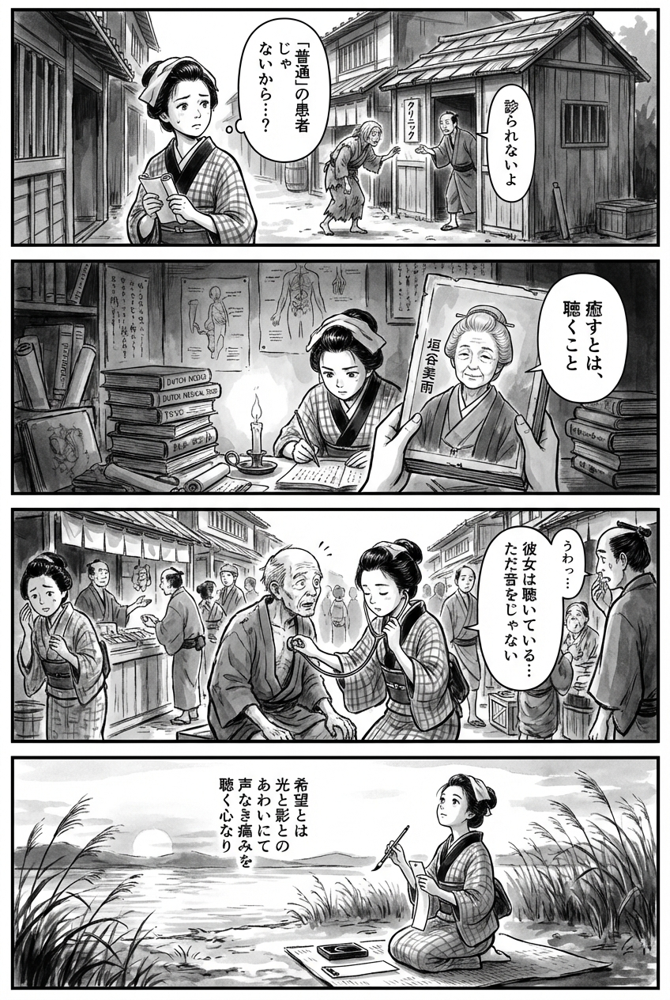

> **Language**: [日本語](../ja/希望病棟_review.html) | [English](../en/希望病棟_review.html) | [繁體中文](../zh-tw/希望病棟_review.html)
>
> [← Top / トップページ](../../)

# 書籍評論（繁體中文）

## 📖 書籍資訊
- **標題**: 希望病棟  
- **作者**: 垣谷美雨  
- **ASIN**: B08M8VRCSV  
- **URL**: [https://www.amazon.co.jp/dp/B08M8VRCSV](https://www.amazon.co.jp/dp/B08M8VRCSV)  

---

<picture>
  <source srcset="../../images/reviews/希望病棟_4panel.webp" type="image/webp">
  
</picture>

## 對白

### Panel 1
**Scene**: 在一條安靜的江戶小巷中，町娘注意到一位病弱的女性因為「看起來不像正常病人」而被診所拒絕。町娘停下腳步，對「正常」這個詞感到困惑。背景中有木造房屋和一個小醫療小屋，喚起人類生命的脆弱感。
**Dialogue**: [無]

### Panel 2
**Scene**: 在一個燭光照明的書房裡，充滿了荷蘭醫學書籍和卷軸，町娘正在查閱一本肖像式的插圖書，裡面描繪了一位眼神平靜、表情溫柔的智慧女性——想像中的作家垣谷美雨的肖像，呈現出一位穿著江戶服裝的60年代學者。這位女性的存在似乎在低語：「治癒就是傾聽。」町娘認真地學習，臉龐被閃爍的蠟燭光照亮。
**Dialogue**: [無]

### Panel 3
**Scene**: 在熱鬧的市場上，町娘使用自製的竹聽診器來聆聽一位貧窮攤販的心跳——不僅是他的胸膛，還有他的沉默。她閉上眼睛，感受到未言的痛苦。周圍的人們看起來驚訝；有一人低聲說：「她在傾聽……不只是聽見。」筆觸強調了同情心而非表面現象。
**Dialogue**: [無]

### Panel 4
**Scene**: 在河岸的日落時分，町娘跪下，手握毛筆和墨水，在短冊上寫下和歌。風吹過蘆葦，伴隨著她對當天所學的反思。短詩內容如下：
**Tanka (translation)**: 希望是在光與影之間，能夠聆聽無聲的痛苦的心。
**Tanka (original)**: 希望とは  
光と影との  
あわいにて  
声なき痛みを  
聴く心なり

## 🎯 本書的核心
《希望病棟》是一部以醫療現場和社會邊緣為舞台，深刻描繪孤獨、貧困、歧視等現代社會陰暗面的群像劇。垣谷美雨通過治驗這一醫療最前線，描繪了生活在「希望」與「現實」之間的人們，揭示了善意背後潛藏的殘酷。

登場人物們在孤獨和貧困的折磨下，通過與他人的關係尋找重生的道路。超越血緣的母性，以及傾聽他人痛苦的能力，引導他們重新獲得人類的尊嚴。  
本書以靜謐而深刻的筆觸，向讀者提出「希望是什麼」「拯救他人意味著什麼」這些根本性問題。

---

## 💡 關鍵見解
- **「希望」有時是殘酷的**  
  善意的言語和對治療的期待，有時會將人逼入絕境。通過醫療現場對「希望」的處理，質疑如何保護他人的尊嚴。

- **「普通」這個詞的暴力**  
  「想雇用普通的高中生」這句話象徵了社會無意識的偏見。人們心中的「普通」幻想，揭示了排斥弱者和使其孤立的結構。

- **母性並非源於血緣，而是由共鳴而生**  
  在親子關係中掙扎的角色們，通過理解和共鳴建立起「母」與「女」的關係，而非依賴血緣。這也是對現代社會家庭的重新定義。

- **貧困不是個人的責任，而是結構性問題**  
  通過獎學金和風俗勞動等現實，描繪社會如何結構性地壓迫個體。對於將貧困視為「自我責任」的風潮，強烈表達了批判。

- **理解他人從「傾聽」開始**  
  通過聽診器聆聽心聲的設定，象徵著「共鳴的力量」。人際關係的本質在於傾聽對方的沉默和痛苦。

---

## 🔍 與現代背景的關聯
在當代日本，孤獨死、貧困、醫療差距等社會問題日益嚴重。《希望病棟》所描繪的「希望的殘酷」和「普通的排斥之詞」，與社交媒體社會中的同調壓力和隱形歧視結構相互交織。

此外，女性經濟獨立和母性的重新定義等主題，在當前性別平等受到質疑的時代中尤為重要。垣谷美雨在故事中可視化現實社會問題，呼籲讀者擁有「傾聽他人痛苦的想像力」。

---

## 🚀 實踐建議
1. **在談論「希望」之前，理解對方的現實**  
   鼓勵的話語有時會成為負擔。需要細心傾聽對方的情況，考慮現實的支持方式。

2. **質疑「普通」這一標準**  
   重新思考自己心中的「普通」是否在排斥某人。擁有接納多元背景人群的靈活性，是共生社會的第一步。

3. **練習「傾聽」他人的聲音**  
   不僅要傾聽語言，還要關注沉默和表情的變化。共鳴是想像他人痛苦的能力，這支撐著人際關係的基礎。

4. **不要將貧困簡化為「自我責任」**  
   重要的是要以社會結構和制度的問題來看待面臨經濟困難的人，而不是指責他們。

5. **「拯救他人」並非「支配他人」**  
   在幫助他人時，不要強加自己的價值觀。意識到尊重對方的意願和尊嚴的支持方式，才能真正達到共鳴。

---

## ⭐ 總體評價
《希望病棟》是一部冷靜而溫暖地描繪生活在社會角落人們的痛苦與重生的作品。通過醫療、貧困、母性等主題，重新質疑人類的尊嚴。

讀後讓人深思，理解他人意味著什麼，如何處理自己心中的「普通」和「善意」。這是一個靜謐卻強烈的希望故事，為當代社會的閉塞感開啟了一扇窗。

---

&copy; shioki | [CC BY-NC-SA 4.0](https://creativecommons.org/licenses/by-nc-sa/4.0/)
