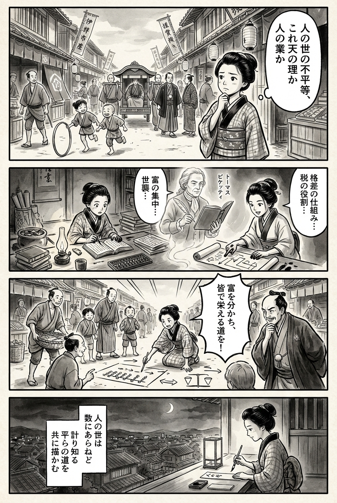

> **Language**: [日本語](../ja/平等についての小さな歴史_review.html) | [English](../en/平等についての小さな歴史_review.html) | [繁體中文](../zh-tw/平等についての小さな歴史_review.html)
>
> [← Top / トップページ](../../)

# 書籍評論（繁體中文）

## 📖 書籍資訊
- **標題**: 平等についての小さな歴史  
- **作者**: トマ・ピケティ and 広野和美  
- **ASIN**: B0DGPWCM84  
- **URL**: [https://www.amazon.co.jp/dp/B0DGPWCM84](https://www.amazon.co.jp/dp/B0DGPWCM84)  

---

<picture>
  <source srcset="../../images/reviews/平等についての小さな歴史_4panel.webp" type="image/webp">
  
</picture>

## 對白

### Panel 1
**Scene**: 在繁忙的江戶市場，町娘注視著一位富有商人的轎子經過，附近的孩子們赤腳玩耍。她微微皺眉，感受到不平衡。背景顯示著木製商店和飄揚的旗幟。她的內心獨白以豎排文字出現，思考「不平等」是自然的一部分還是人為造成的。

### Panel 2
**Scene**: 在昏暗的寺子屋學習室內，她專心地翻閱荷蘭和中文書籍。一個幽靈般的「托馬斯·皮凱提」從書頁中出現，想像成一位穿著簡樸的歐洲學者，長髮束起，手持羽毛筆和帳本。在他身旁，一位受到「野宏美」啟發的年輕日本翻譯者（女性，冷靜的舉止，學者風格的和服）幫助解釋社會結構和稅收的概念。周圍有捲軸和算盤，沾滿墨水的手勢生動地表達。

### Panel 3
**Scene**: 現在町娘站在城鎮廣場，用棍子在地上畫圖，向魚販和孩子們解釋公平的稅收如何讓每個人都能繁榮。她的熱情讓人群感到驚訝；甚至之前那位嚴厲的商人也向前傾身，充滿好奇。動態的構圖和揮灑的筆觸傳達出運動和信念。

### Panel 4
**Scene**: 黃昏時分，町娘坐在紙燈籠旁，手握毛筆，在狹窄的短冊上作詩。燈光柔和地映照在她的臉上，她望向遙遠的城市天際線。詩的內容是：

「  
人の世は  
数にあらねど  
計り知る  
平らの道を  
共に描かむ  
」

## 🎯 本書的核心
《平等についての小さな歴史》試圖將經濟不平等重新定義為「社會、政治和制度所產生的建構物」，而非「自然的結果」。ピケティ追溯了從18世紀末到現代平等的歷程，歷史性地檢視社會國家和累進稅制如何縮小了差距。  

本書的核心信念是「平等並不是已結束的理想，而是持續進行的政治鬥爭」。作者描繪了市民的知識和行動如何成為改變經濟權力結構的動力，並為建構分權和民主的社會主義鋪路。  

---

## 💡 關鍵見解
- **平等是鬥爭的成果**  
  平等歷史上是透過打破統治階級的抵抗而獲得的。社會運動和政治鬥爭的積累，透過制度改革縮小了不平等。  

- **經濟知識的民主化支撐民主**  
  不將經濟專業化，讓市民理解數據和制度，是改變權力結構的第一步。知識的共享是民主控制的基礎。  

- **環境與社會的不平等是不可分割的**  
  解決氣候危機必須以實現社會公正為前提。將環境政策與再分配政策分開，將使可持續的未來變得遙不可及。  

- **累進稅制可兼顧經濟成長與平等**  
  高稅率的累進稅制在歷史上同時實現了經濟成長和縮小差距的事實，重新評估稅制作為社會結構變革的工具。  

- **殖民主義的清算仍是未竟之業**  
  殖民統治和奴隸制的遺產至今仍影響著財富的分配。沒有賠償或補償正義，真正的平等無法實現。  

---

## 🔍 與當代背景的關聯
在2020年代中期的世界中，AI和自動化所帶來的「技術不平等」正在產生新的差距。正如ピケティ所指出的，不平等並非經濟的自然現象，而是政治選擇的結果。各國對富裕階層課稅和最低法人稅率的討論，正印證了本書的主張。  

此外，氣候危機與不平等的結合，催生了「環境正義」這一新的政治議題。將財富再分配與脫碳政策結合的動作，是ピケティ所提倡的「基於社會正義的全球合作」的具體化。在日本，「令和的格差」論的擴散，使得教育、性別和資產差距的矯正成為社會的要求，本書的訊息愈發具有現實意義。  

---

## 🚀 實踐建議
1. **提升經濟素養**  
   自行學習經濟指標和稅制的運作，批判性地檢視媒體和政治的言論，將是增強市民力量的第一步。  

2. **要求重新評估累進稅制與社會支出**  
   支持對收入和資產徵收高稅率，促進對教育、醫療和環境的再投資，以助於重建社會國家。  

3. **監督教育資源的透明化**  
   可視化教育支出和獎學金制度的差距，要求政策矯正因出身而造成的機會不平等。  

4. **支持全球公平稅制**  
   支持國際課稅協定和環境標準的建立，明確企業和富裕階層的責任，以對抗跨境不平等。  

5. **加強地方層級的民主參與**  
   參與地方自治和市民協議會等分權決策的場合，能夠從地方開始建立實質的平等。  

---

## ⭐ 總體評價
《平等についての小さな歴史》不僅僅是一本經濟書，更是一本從根本上質疑社會存在方式的政治與倫理書籍。ピケティ通過數據和歷史，明確表明平等不是「幻想」，而是「選擇」。  

本書面向的不僅是對經濟學和政治哲學感興趣的讀者，更是對當代社會不公感到疑惑的所有人。隨著閱讀的深入，讀者將意識到平等的歷史不僅是「過去」，而是「未來的設計圖」。

---

&copy; shioki | [CC BY-NC-SA 4.0](https://creativecommons.org/licenses/by-nc-sa/4.0/)
