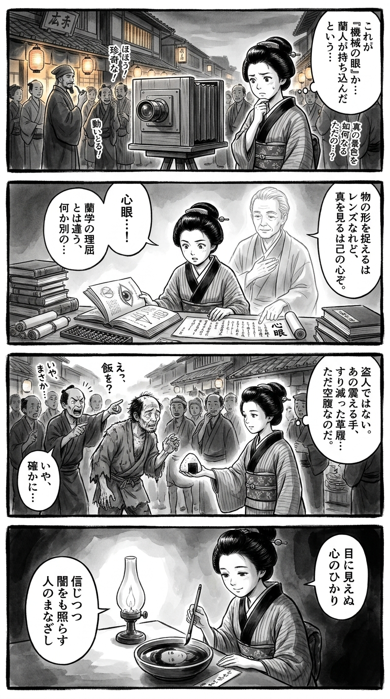

> **Language**: [日本語](../ja/心眼_review.html) | [English](../en/心眼_review.html) | [繁體中文](../zh-tw/心眼_review.html)
>
> [← Top / トップページ](../../)

# 書籍評論（繁體中文）

## 📖 書籍資訊
- **標題**: 心眼  
- **作者**: 相場 英雄  
- **ASIN**: B0H2YDN7JX  
- **URL**: [https://www.amazon.co.jp/dp/B0H2YDN7JX](https://www.amazon.co.jp/dp/B0H2YDN7JX)  

---

<picture>
  <source srcset="../../images/reviews/心眼_4panel.webp" type="image/webp">
  
</picture>
## 🎯 這本書的核心
《心眼》是一部超越警察小說範疇的作品，探討「人類是什麼」。透過見當偵查這一類比的手法，描繪出在科技主導的現代社會中，「人類的眼睛」與「心靈」的價值。  
主角片桐在經驗與苦悶中，逐漸獲得能夠洞察本質的「心眼」，這個過程同時是他作為刑警的成長故事，也是對人類尊嚴與正義的哲學探索。  
在人工智慧與監視攝像頭主導偵查的時代，作者靜靜地呼籲「人類的判斷力與倫理觀才是最後的防線」。

---

## 💡 關鍵洞察
- **「心眼」是經驗與人性理解的結晶**  
　片桐所學的「心眼」並非單純的直覺，而是從經驗與觀察中累積而來的洞察力。能夠看透數據無法捕捉的人性本質，成為真正的偵查力。

- **類比的努力產生信任**  
　片桐手動整理照片的場景，雖然看似低效，但卻被描繪成對對象的敬意與專注的行為。在數位化日益普及的現代，重新確認花時間的意義。

- **罪犯也是社會的受害者**  
　相場不將犯罪簡單地視為個人的惡行。他描繪出在貧困與孤立等社會結構中產生的「另一種受害者性」，促使讀者擴展對人性的理解。

- **技術創新考驗倫理**  
　人工智慧的面部識別與監視攝像頭的進步，潛藏著在效率背後奪走「人類判斷力」的危險。作者敏銳地描繪出技術進步所帶來的倫理空白。

- **正義存在於信念而非制度**  
　那些為了保護人類尊嚴而違背上層命令的刑警們，展現了正義的根源在於個人的良知，而非制度。

---

## 🔍 與現代文脈的關聯
本作的核心「類比與數位的對立」與對人工智慧監視社會的擔憂深刻相連。在防盜攝像頭與面部識別技術日常化的現代，存在著在效率與安全的背後，「人類判斷」被輕視的危險。  
此外，貧困與孤立成為犯罪溫床的現實，與現代日本的社會分裂相呼應。相場英雄透過犯罪揭示社會的扭曲，挑戰讀者思考「看見」與「理解」的差異。  
《心眼》可被視為對科技進步所帶來的倫理空白的文學警鐘，呼籲我們重拾「人類的眼睛」。

---

## 🚀 實踐建議
1. **在日常生活中意識到「心眼」**  
　不僅僅表面判斷人或事件，而是培養想像背景與動機的習慣，從而鍛鍊洞察力。

2. **重拾手動的時間**  
　在數位化的生活中，融入手寫日記、整理等類比行為，能夠帶來思考的深度與情感的真實感。

3. **持有「耕耘資訊」的姿態**  
　不追求短期成果，而是在建立信任關係的過程中深入挖掘資訊。這是一種普遍適用於商業與人際關係的姿態。

4. **培養不過度依賴技術的判斷力**  
　不應盲目相信人工智慧或數據的結果，而是根據自身的倫理觀與經驗進行判斷，這一訓練至關重要。

5. **意識到「空白的十五秒」**  
　面對意外情況時，暫停一下再做決定，能夠使我們冷靜地應對，這也是危機管理的一項技術。

---

## ⭐ 總體評價
《心眼》是一部超越警察小說的「人性理解之書」。相場英雄透過偵查現場這一極限的人性戲劇，質疑科技時代中倫理與直覺的價值。  
讀者將與片桐一同體驗「看見」的困難與「洞察」的珍貴。在追求效率與成果的現代社會中，本作靜靜地重新提問「作為人類的意義」。

---

&copy; shioki | [CC BY-NC-SA 4.0](https://creativecommons.org/licenses/by-nc-sa/4.0/)
