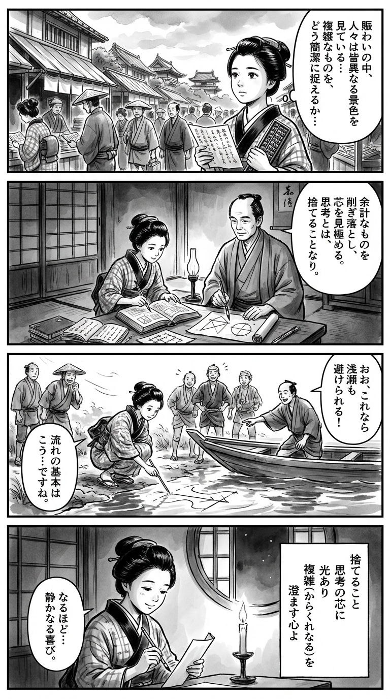

> **Language**: [日本語](../ja/思考の方法学_review.html) | [English](../en/思考の方法学_review.html) | [繁體中文](../zh-tw/思考の方法学_review.html)
>
> [← Top / トップページ](../../)

# 書籍評論（繁體中文）

## 📖 書籍資訊
- **標題**: 思考の方法学  
- **作者**: 栗田治  
- **ASIN**: B0CHRMHM3R  
- **URL**: [https://www.amazon.co.jp/dp/B0CHRMHM3R](https://www.amazon.co.jp/dp/B0CHRMHM3R)  

---

<picture>
  <source srcset="../../images/reviews/思考の方法学_4panel.webp" type="image/webp">
  
</picture>
## 🎯 這本書的核心
《思考の方法学》是一本系統性解釋「模型思考」的知識實踐書，旨在幫助讀者理解現實、做出判斷並採取行動。作者栗田治將模型視為不僅僅是分析工具，而是「捨棄的技術」，從兩個方面描繪簡化複雜現實的意義與危險。

本書的中心思想是「目的合理性」與「在限制條件下的最佳化」，這些都是理科思考的原則。將其與社會及倫理背景相連結，質疑思考的誠實性，這是本書的獨特之處。作者在理論與實踐、定量與定性、理學與工學等二元對立中架起橋樑，提出「模型素養」作為現代人必備的能力。

---

## 💡 關鍵洞察
- **模型思考是人類根本的活動**  
  本書主張，每個人都在無意識中使用模型來理解世界。思考是對現實的簡化，意識到模型化可以顯著提升判斷的質量。

- **「捨棄」是思考的核心**  
  模型化是勇敢地剔除不必要資訊的行為。通過減少複雜性，思考獲得了清晰性和可重現性。

- **定量與定性的融合帶來真正的理解**  
  不僅僅依賴數值分析，還要整合處理意義和關係的定性思考，才能捕捉現實的多面性。

- **防止目的與手段顛倒的倫理思考**  
  為了避免手段目的化的「迷信」，需要不斷反思「為了誰」「為了什麼」。思考的健全性依賴於倫理自覺。

- **模型素養是信息社會的防線**  
  看穿信息背後的模型結構，正是保護自己免受錯誤信息和偏見的知識防禦。

---

## 🔍 與現代背景的關聯
在當代社會，人工智慧和數據分析已成為決策的核心，模型化的影響力前所未有地增強。栗田所提倡的「模型素養」，在這個信息社會中具有極其現代的意義，成為知識自主的條件。

此外，在教育和人才培養領域，基於邏輯思考的問題解決能力受到重視。栗田本人在產學合作和體育界的課題分析中應用模型思考，本書的理念在現實社會的多樣領域中具有實踐價值。

進一步而言，在解讀社會規範和文化表達的變化時，意識到「以何種前提來模型化世界」是不可或缺的。本書被視為整合科學思考與倫理想像力的指導。

---

## 🚀 實踐建議
1. **將自己的思考可視化為模型**  
   意識到重視哪些要素，捨棄了什麼，可以提高思考的透明性和可重現性。

2. **定期檢查目的與手段**  
   在項目或日常判斷中，確認手段是否目的化，這是保持思考健全性的關鍵。

3. **將定量分析與定性洞察相結合**  
   解讀數據背後的意義和背景，能夠獲得更深刻的理解和說服力。

4. **減少前提條件以提高創造力**  
   重新檢視思考或計劃的前提，去除不必要的限制，能夠促進新的想法產生。

5. **在接收信息時懷疑模型的存在**  
   反思「基於何種模型的主張」，能夠自我檢驗信息的可靠性。

---

## ⭐ 總體評價
《思考の方法学》是一本將思考本身作為對象，架橋邏輯、倫理與實踐的珍貴著作。它不僅僅是思考方法的指南，更是對「思考意味著捨棄什麼、保留什麼」這一知識行為本質的探討。

無論是理科還是文科，面對複雜現實的所有讀者，本書都是促進思考再訓練的文本。閱讀後，將會體會到世界觀的清晰度提升。

---

&copy; shioki | [CC BY-NC-SA 4.0](https://creativecommons.org/licenses/by-nc-sa/4.0/)
