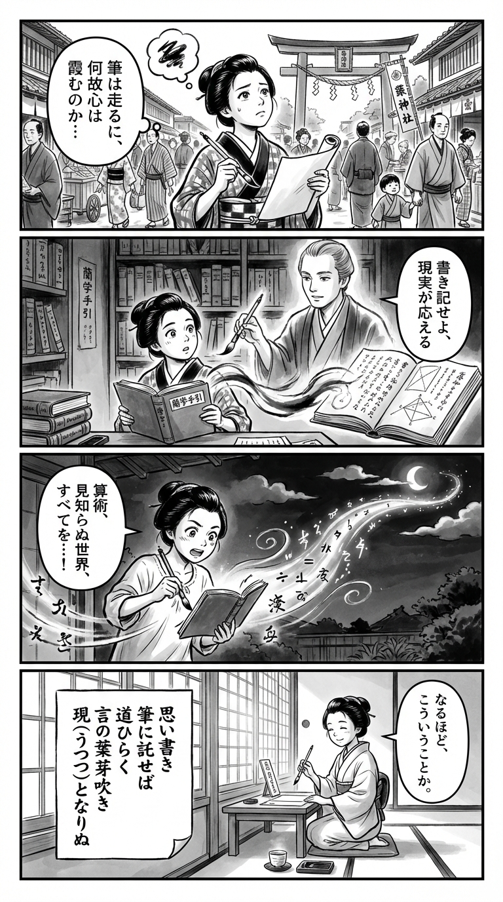

> **Language**: [日本語](../ja/思考は文字化すると現実化する_review.html) | [English](../en/思考は文字化すると現実化する_review.html) | [繁體中文](../zh-tw/思考は文字化すると現実化する_review.html)
>
> [← Top / トップページ](../../)

# 書籍評論（Markdown・繁體中文）

## 📖 書籍資訊
- **標題**: 思考は文字化すると現実化する  
- **作者**: 横川 裕之  
- **ASIN**: B08BQWBZZQ  
- **URL**: [https://www.amazon.co.jp/dp/B08BQWBZZQ](https://www.amazon.co.jp/dp/B08BQWBZZQ)  

---

<picture>
  <source srcset="../../images/reviews/思考は文字化すると現実化する_4panel.webp" type="image/webp">
  
</picture>
## 🎯 這本書的核心
本書的中心思想是「透過將思考文字化來獲得改變現實的力量」，這是一個明確的哲學觀點。作者横川裕之透過將腦海中模糊的思考寫在紙上或數位平台上，將自己的內心可視化，並將其轉化為行動的過程進行系統化。  

本書不僅僅是自我啟發，而是通過「思考的結構化」「行動的習慣化」「自我認同的強化」這三位一體的實踐方法，引導讀者能夠主動設計自己的生活。將思考外化視為自我理解和現實創造的起點，這一發想貫穿始終。  

---

## 💡 關鍵見解
- **將思考外化可提高精確度**  
　與其在腦中思考，不如將其寫下來，這樣思考的結構會變得更加明確。這就像筆算比心算更準確一樣，思考的「可視化」是現實化的第一步。  

- **將未來文字化可激發行動**  
　通過將目標語言化，現實與目標之間的差距變得可視化。這種自然的行動意願會促使人們去填補這一差距，最終使現實開始改變。  

- **小行動培養自我信任**  
　僅僅「實行一個原本打算做的事情」，也能增強自我信任的力量。持續的小成功經驗支撐著現實化的持久力。  

- **失敗不是價值的喪失，而是學習**  
　重要的是不要害怕失敗，而是從中提取學習。作者斷言「失敗不會讓你的價值消失」，並強調持續挑戰才是現實化的條件。  

- **用斷定語氣表達可提高自我認同感**  
　使用「能做到」「會去做」這樣的斷定性語言，能在潛意識中刻下自我信任。將思考的文字化與斷定表達結合，能顯著提高行動的推動力。  

---

## 🔍 與現代背景的關聯
在數位化迅速發展的當今，思考容易在信息的洪流中變得片段化。隨著社交媒體和消息應用程序中短文表達的普及，「將思考文字化以進行整理的能力」變得愈加珍貴。作者提倡的「思考的文字化」應該被重新評價，作為在信息過載時代的自我重建方法。  

此外，在教育現場，為了培養「思考、判斷、表達能力」，文字化和結構化的訓練正受到重視。横川的這一方法與這一潮流相呼應，成為促進個人「思考再教育」的實踐書籍。  

在當今社會中，社交媒體的發表和自我表達對社會意識的形成產生影響，「將內省語言化」不僅僅是自我成長的過程，更是建立社會對話基礎的行為。本書在這個意義上，成為個人變化與社會成熟之間的思想橋樑。  

---

## 🚀 實踐建議
1. **每天花15分鐘將思考文字化**  
　即使是短時間，每天將自己的想法和情感寫在筆記本上，可以促進思考的整理和行動的明確化。持續進行將鍛鍊「現實化的肌肉」。  

2. **每天記錄「做成的事情」**  
　將小成就寫下來，可以提高自我認同感和自我效能感。這能夠建立不怕失敗的心理基礎。  

3. **將目標明確化為期限和數字**  
　設定「何時完成」「多少」可以具體化行動計劃。通過達成與未達成的分析，形成提高行動質量的習慣。  

4. **立即行動（思即實行）**  
　為了打破現狀維持的機制，消除思考與行動之間的時間延遲。即時行動的習慣將形成不懼變化的體質。  

5. **將學習視為「自己的事」**  
　在學習時不斷問自己「如果是我，會怎麼做？」將知識轉化為實踐的力量。從被動學習轉向主動學習，是現實化的關鍵。  

---

## ⭐ 總體評價
《思考は文字化すると現実化する》是一本實踐性地闡明思考、行動與自我認知關係的書籍。與抽象的「吸引力法則」或「自我啟發」不同，本書以邏輯性和可重複性的方法論，將思考的外化與行動化結合起來，展現出其卓越之處。  

特別是在當今信息過載的社會中，提供了「找回自我思考」的具體手段，這一點具有重要價值。對於希望深入自我理解、想要行動卻無法踏出第一步的人，以及在日常生活中尋求思考整理的所有人來說，本書將成為一個可靠的指南。

---

&copy; shioki | [CC BY-NC-SA 4.0](https://creativecommons.org/licenses/by-nc-sa/4.0/)
