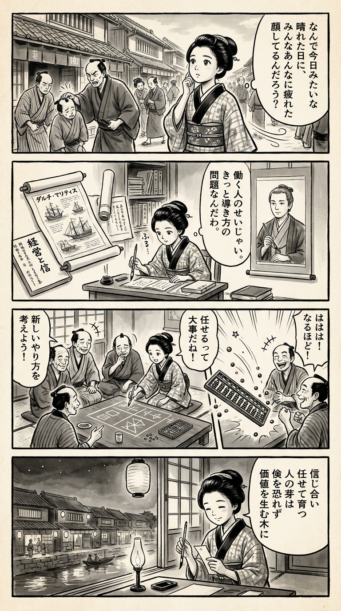

> **Language**: [日本語](../ja/日本の会社員はなぜ「やる気」を失ったのか_review.html) | [English](../en/日本の会社員はなぜ「やる気」を失ったのか_review.html) | [繁體中文](../zh-tw/日本の会社員はなぜ「やる気」を失ったのか_review.html)
>
> [← Top / トップページ](../../)

# 書籍評論（繁體中文）

## 📖 書籍資訊
- **標題**: 日本的公司員工為何失去了「幹勁」  
- **作者**: 渋谷和宏  
- **ASIN**: B0CN6MPK2C  
- **網址**: [https://www.amazon.co.jp/dp/B0CN6MPK2C](https://www.amazon.co.jp/dp/B0CN6MPK2C)  

---

<picture>
  <source srcset="../../images/reviews/日本の会社員はなぜ「やる気」を失ったのか_4panel.webp" type="image/webp">
  
</picture>

## 對白

### Panel 1
**Scene**: 町娘走過繁忙的江戶街道，靜靜地觀察商人和學徒在嚴格的監督下工作。她歪著頭，感到有些奇怪——每個人看起來都很盡責，但卻沒有快樂。微風輕拂她的袖子，她低聲說：“為什麼他們在這麼明亮的日子裡看起來這麼疲憊？”背景中可以看到一排商店和一位商人正在責罵一名店員。

### Panel 2
**Scene**: 在她的小書房裡，她展開了一本有關商業的荷蘭論文和一篇關於“管理中的信任”的日本文章。附近掛著一幅描繪想像中的學者的卷軸——以作者渋谷和宏為模型，眼神平靜而深思，身材中等，頭髮整齊地綁著，穿著學者的長袍，手中握著筆，似乎在思考。他的表情散發出溫和的智慧和真誠。町娘專心地學習，筆尖懸停，低聲說：“這不是工人的錯，而是他們被引導的方式。”

### Panel 3
**Scene**: 現在在茶館的町娘，召集看起來因工作而疲憊的鄰居們。她用粉筆在榻榻米上畫出“信任孕育創造”的圖示，使用算盤符號和幾何圖案。當他們開始提出新的工作和價值分享方式時，大家都笑了。幽默的一幕：她的算盤突然崩潰，珠子像流星般四散而出——每個人都笑了，臉上重新洋溢著光彩。

### Panel 4
**Scene**: 黃昏時分，町娘坐在窗邊，凝視著江戶的燈籠閃爍。她面帶平靜的微笑，在小短冊上寫下一首和歌，筆在燈光下閃爍。  
**Tanka (translation)**: 彼此信任，讓人們茁壯成長，  
不懼節儉，成為價值之樹。  
**Tanka (original)**:  
「信じ合い　任せて育つ　人の芽は  
　倹を恐れず　価値を生む木に」

## 🎯 本書的核心
本書試圖將日本企業中普遍存在的「幹勁喪失」重新視為經營結構的問題，而非員工個人的怠惰。作者渋谷和宏指出，自泡沫經濟崩潰以來的「縮小經營」和對人力資源的輕視，已經奪走了員工的意願和創造力。

在成果主義的名義下進行的人事費用削減、過度控制的微觀管理、缺乏教育投資等，正在侵蝕企業的長期競爭力。作者主張，經營的再生必須「信任、投資並委託員工」。

其核心在於，經營者必須轉變思維，將重心從「節約」轉向「創造價值的投資」，並將員工視為資產而非成本。本書提出了一個結構性且人性化的處方，以幫助日本企業重新獲得活力。

---

## 💡 關鍵洞察
- **失去幹勁的原因在於經營而非員工**  
  將生產力低下和意願缺乏歸咎於員工個人責任，而應尋找經營的錯誤判斷。只有當組織文化和管理結構改變，任何制度改革才會有效。

- **成果主義的誤用破壞了信任**  
  成果主義本應旨在公平評價，但實際上卻成為削減人事費用的工具。結果，員工感到努力得不到回報，失去了對組織的信任。

- **「恐嚇經營」扼殺創造力**  
  透過恐懼進行的控制雖然能帶來短期成果，但從長遠來看卻奪走自發性和創造力。在微觀管理盛行的職場中，員工會變得過於依賴上司的意見，思考停滯成為常態。

- **幸福感與生產力的相關性**  
  自由度高且心理安全感強的工作環境中，幸福感更高，創造性成果也更佳。忽視幸福感的經營最終會降低企業價值。

- **經營者的本質是「花錢」**  
  經營者的使命在於花錢為員工和社會創造價值，而非節約。害怕投資的經營行為等同於放棄未來。

---

## 🔍 與現代背景的關聯
近年來，日本企業的「低參與度」問題愈發嚴重。許多員工感到「努力也無法得到回報」、「提出意見也不會改變」，陷入靜默離職（Quiet Quitting）的狀態。這與本書所指出的「縮小經營」問題息息相關。

同時，心理安全性、讚賞文化和對話式管理等新潮流也受到關注。這與作者提倡的「信任並引導員工的管理」回歸相呼應。

在成果主義的局限性和中堅層的停滯感被討論的當下，本書的建議不僅是批評，更應被重新評價為組織再生的實踐指南。

---

## 🚀 實踐建議
1. **重新開始對員工的投資**  
   將教育和技能開發的投資視為「未來的資本」，而非「成本」。這將提升員工的自我效能感，恢復組織的創造力。

2. **引入加分制的評價制度**  
   停止減分制，轉向評價挑戰和成長的機制。鼓勵不懼失敗的挑戰文化，支持長期創新。

3. **消除微觀管理**  
   上司應成為「引導者」而非「指示者」。減少報告和監控，擴大員工的裁量權和信任，讓主動性自然萌芽。

4. **減少無意義的工作**  
   重新設計業務以目的為基礎，創造讓員工能夠感受到「為何工作」的環境。這將是提升幸福感和生產力的關鍵。

5. **更新經營者自身的管理觀**  
   經營者應回到「通過投資創造價值」的根本。信任並委託員工的勇氣是企業再生的第一步。

---

## ⭐ 總體評價
本書深刻挖掘了長期以來困擾日本企業的「縮小思維」和「輕視人才」的結構。它不僅是一本批評書，更是一本針對經營者、管理層和員工提出「信任人為本的經營」的實踐建議書。

特別是在心理安全性和參與度成為當前經營課題的背景下，本書的洞察絕非過去的故事。作為日本企業再次依靠人力成長的「重啟之書」，將為許多讀者帶來深刻的啟示。

---

&copy; shioki | [CC BY-NC-SA 4.0](https://creativecommons.org/licenses/by-nc-sa/4.0/)
