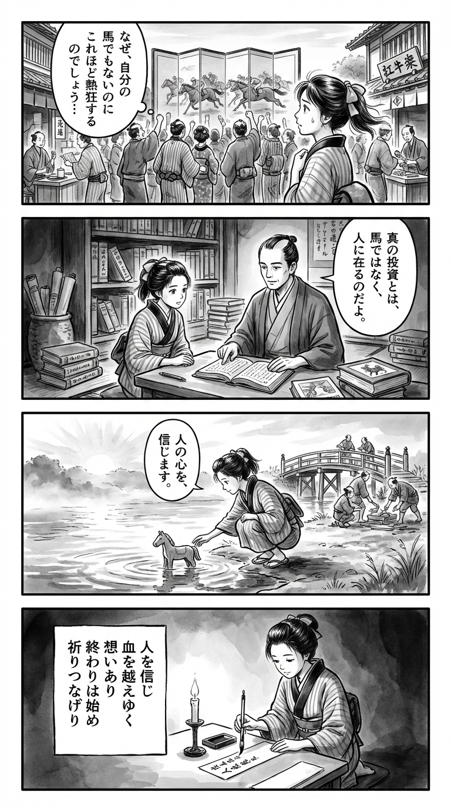

---
---
> **Language**: [日本語](../ja/早見和真-ザ・ロイヤルファミリー（新潮文庫）_review.html) | [English](../en/早見和真-ザ・ロイヤルファミリー（新潮文庫）_review.html) | [繁體中文](../zh-tw/早見和真-ザ・ロイヤルファミリー（新潮文庫）_review.html)
>
> [← Top / トップページ](../../)

## 📖 書籍資訊
- **書名**: ザ・ロイヤルファミリー（新潮文庫）  
- **作者**: 早見和真  
- **ASIN**: B0BKRHWGL3  
- **URL**: [https://www.amazon.co.jp/dp/B0BKRHWGL3](https://www.amazon.co.jp/dp/B0BKRHWGL3)  

---

## 對白

### Panel 1
**Scene**: 在熱鬧的江戶街道上，兩旁是茶屋與書肆。町娘停下腳步，望著人群圍觀著畫屏上的賽馬圖。她露出困惑的神情，心想為何人們會如此熱烈地為並非自己所有的馬歡呼。微風拂起她的髮帶，她若有所思地凝視著前方，背景中充滿了庶民下注的喧鬧氣息。  
**Dialogue**: 「為什麼大家要為不屬於自己的馬這麼激動呢……？」

### Panel 2
**Scene**: 在一間燈光昏暗的書齋裡，堆滿了卷軸與從荷蘭進口的書籍。町娘正與一位沉穩的學者對坐——他神情冷靜，髮束整齊，眼神聰慧，身著素袍卻散發著堅定的氣質。他指著一本荷蘭書，語氣平靜地說，真正的投資並非在馬匹，而是在人心。書架間的墨影加深，氣氛靜謐而深思。  
**Dialogue**: 「真正的投資，不在馬，而在人。」

### Panel 3
**Scene**: 拂曉時分，町娘站在河畔，將自己雕刻的小木馬放入水中，象徵著新的決心。她低聲呢喃，說要「相信他人的心」。木馬隨著朝陽漂流而去，水面映出金色的光。附近的町人們正互相幫忙修橋，象徵希望與延續。筆觸流動，水波與光影交織出重生的意象。  
**Dialogue**: 「我會相信他人的心。」

### Panel 4
**Scene**: 夜裡，町娘跪坐在書案前，手持毛筆，凝視著短冊。燭光搖曳，她的眼神平靜而堅定，開始書寫一首關於「信任、傳承與希望」的和歌。紙上墨跡縱流，詩意悠遠。  
**Dialogue**: （無台詞，僅有她靜靜書寫的畫面）  
**Tanka (translation)**:  
「相信他人之心，  
有情能超越血脈。  
終結亦是開端，  
祈願相續不斷。」  
**Tanka (original)**:  
「人を信じ  
血を越えゆく  
想いあり  
終わりは始め  
祈りつなげり」

## 🎯 本書的核心
《ザ・ロイヤルファミリー》是一部透過華麗卻孤獨的賽馬舞台，描繪「傳承」與「信任」的人性劇。父與子、師徒、企業主與員工等多層關係交織，故事的核心在於超越血緣的「情感傳承」。  

故事講述懷抱對亡父遺憾的主角，遇見人力派遣公司社長山王耕造，並透過他重新發現「父性」與「信任」的過程。賽馬的世界在此成為人生縮影，象徵著「希望的循環」。  

早見和真直視資本主義的矛盾與倫理困境，卻仍主張「相信人」才是活下去的力量。本書靜靜照亮了成功與失敗之後的人性尊嚴。  

---

## 💡 關鍵洞見
- **「投注於人」才是真正的投資**  
  社長的一句話：「不是投資在馬身上，而是賭在人身上」，對結果至上的現代社會是一記犀利的反思。本書揭示了信任他人的力量，正是推動組織與社會的原動力。  

- **在倫理與利益之間堅守的自尊**  
  透過派遣業的描寫，展現了追求利益背後潛藏的倫理掙扎。社長那句「即便如此，也要懷抱自豪」成為任何職業都適用的誠實生活準則。  

- **賽馬是「祈禱的共同體」**  
  在賽馬場上，人們齊聲祈禱的場景，象徵著超越社會分裂的希望共享。這種超越勝負的「祈禱連結」，反映出人類最根本的渴望。  

- **傳承不是血緣，而是信念的傳遞**  
  正如那句「父與子的故事不可能就此結束」所象徵的，真正的傳承並非血脈，而是將信念與夢想託付給下一代。本書在賽馬與人生的雙重層面中描繪了這種傳承的姿態。  

- **超越死亡的希望連鎖**  
  「ロイヤルホープ」之死與「ロイヤルファミリー」的誕生，構成了「終結」化為「起點」的結構。故事的核心在於不懼死亡，將希望延續下去的珍貴意義。  

---

## 🔍 與現代脈絡的關聯
本書所描繪的「勞動與倫理」、「傳承與信任」主題，與當代不穩定的勞動環境及家庭關係的淡薄深深共鳴。人力派遣制度下的勞動者現實，正是許多企業仍面臨的倫理縮影。  

此外，透過賽馬共同體所呈現的「祈禱」與「希望共享」，讓人在日益孤立的現代重新思考與他人連結的意義。超越血緣與頭銜的「情感傳承」訊息，在世代斷裂日益嚴重的今日，更顯得格外切實。  

---

## 🚀 實踐建議
- **以信任為基礎面對他人**  
  與其追求成果，不如以信任為出發點，才能建立長久關係。在重視數據與效率的現代社會中，信任才是最珍貴的資產。  

- **對自己的工作懷抱自尊**  
  沒有絕對正確的職業，重要的是對自己的行為誠實。社長的態度提醒我們，無論身處何種位置，都要「懷抱自豪地工作」。  

- **有意識地傳承**  
  思考自己想傳達給家人、部屬或後輩的是什麼，這將使人生更有深度。意識到超越血緣的「情感傳承」，才能塑造未來。  

- **創造共享希望的場域**  
  如同賽馬場上的祈禱，主動打造能共享夢想與願望的空間。擁有共同目標，能強化組織與家庭的連結。  

---

## ⭐ 綜合評價
《ザ・ロイヤルファミリー》是一部超越賽馬題材的「人性史詩」。以父子之情為軸，層層描繪信任、倫理與希望等普世主題，為讀者留下深刻餘韻。  

這是一部可作為家庭小說、企業小說，亦可作為人生論閱讀的難得之作。對那些仍願意相信「信任他人之力」的人而言，這本書是一份靜靜遞出的禮物。

---

&copy; shioki | [CC BY-NC-SA 4.0](https://creativecommons.org/licenses/by-nc-sa/4.0/)
