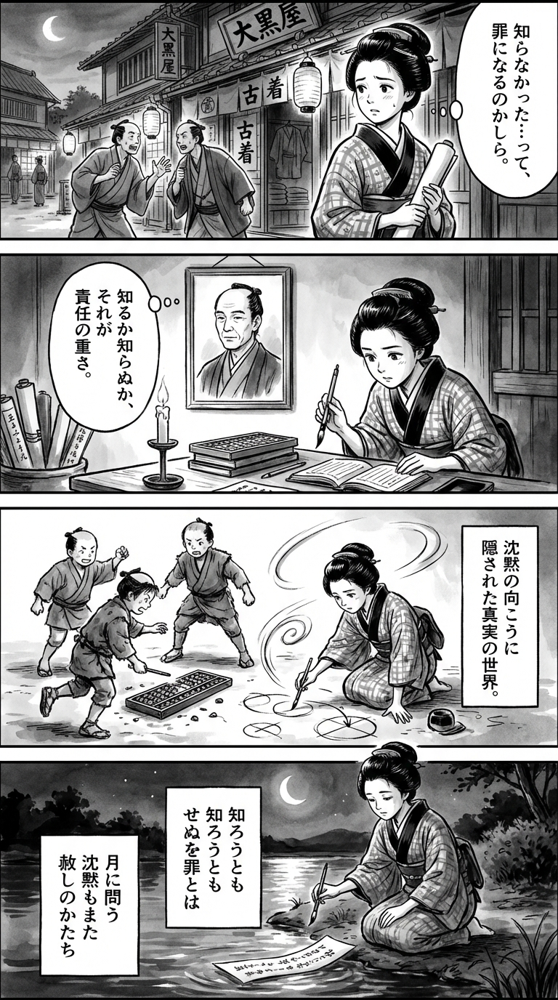

---
---
> **Language**: [日本語](../ja/早見和真-ラストインタビュー―藤島ジュリー景子との47時間―_review.html) | [English](../en/早見和真-ラストインタビュー―藤島ジュリー景子との47時間―_review.html) | [繁體中文](../zh-tw/早見和真-ラストインタビュー―藤島ジュリー景子との47時間―_review.html)
>
> [← Top / トップページ](../../)

## 📖 書籍資訊
- **書名**: ラストインタビュー―藤島ジュリー景子との47時間―  
- **作者**: 早見和真  
- **ASIN**: B0FCDT2C8J  
- **URL**: [https://www.amazon.co.jp/dp/B0FCDT2C8J](https://www.amazon.co.jp/dp/B0FCDT2C8J)  

---

<picture>
  <source srcset="../../images/reviews/早見和真-ラストインタビュー―藤島ジュリー景子との47時間―_4panel.webp" type="image/webp">
  
</picture>
## 對白

### Panel 1
**Scene**: 傍晚的江戶街道熱鬧喧囂，町娘夾著卷軸走過，聽見商人們爭論著「出錯時該由誰負責」。她停下腳步，神情困惑。燈籠的光在她沉思的臉上閃爍，街巷狹窄，木製招牌與行人交錯，氣氛充滿暮色的溫度。  
**Dialogue**: 「不知道……也算是一種罪嗎？」

### Panel 2
**Scene**: 小書齋內燭光搖曳。町娘坐在蘭學卷軸與算盤板前，牆上掛著一幅男子肖像——被想像為早見一位學者，神情沉靜，衣著樸素，髮束整齊，雙眼彷彿能「看透沉默」。畫像似乎活了過來，低語著：「知與不知，皆是責任的重量。」町娘凝視著畫像，心中燃起靈感。  
**Dialogue**: 「知與不知——那就是責任的重量。」

### Panel 3
**Scene**: 町娘來到寺子屋，孩子們為一個壞掉的算盤爭吵。她上前溫柔地教導他們分擔錯誤、從中學習。她在沙地上畫出重疊的圓圈，象徵彼此的連結。孩子們驚訝地看著她，聽她比喻：「世界也常將真相藏於沉默之後。」筆觸流動，氣勢如墨浪翻湧。  
**Dialogue**: 「世界也會在沉默中隱藏真理。」

### Panel 4
**Scene**: 夜晚的河岸，月光映照在水面。町娘跪坐，手持毛筆，在紙條上寫下短歌，任其隨水漂流。她的表情帶著哀愁與寧靜交織的神色。  
**Dialogue**: （無台詞，只有筆墨流動的聲音）  
**Tanka (translation)**:  
我問明月——  
若不求知也成罪，  
那沉默是否  
也是一種  
寬恕的形狀。  
**Tanka (original)**:  
「  
知ろうとも  
せぬを罪とは  
月に問う  
沈黙もまた  
赦しのかたち  
」

## 🎯 本書的核心
《ラストインタビュー―藤島ジュリー景子との47時間―》是一部記錄前傑尼斯事務所社長藤島茱莉景子，面對母親瑪麗喜多川的支配性關係，以及叔父強尼喜多川性侵事件的作品。  
在母女衝突、組織崩壞與社會譴責三重壓力之下，茱莉逐漸意識到自己犯下的錯誤，不是「不知道」，而是「不願去知道」。

作者早見和真既非揭發者，也非辯護者，而是以「小說家」的身份，挖掘沉默背後的人性真相。  
他的筆觸既是一篇揭露娛樂圈黑暗的報導文學，同時也是一部關於「寬恕」與「重生」的人性劇，深深觸動讀者的心。

---

## 💡 關鍵洞見
- **對「不願知道」之罪的自覺**  
  茱莉的言語並非單純的無知，而是對「逃避選擇」這種人性弱點的坦白。這迫使讀者重新思考「責任」的真正意義。

- **母親瑪麗的支配結構與「正義」的扭曲**  
  瑪麗「母親高於女兒」的意識，象徵了家族經營的極限。當善意的正義轉變為獨斷，組織的崩壞便隨之而來。

- **媒體與輿論的暴力性**  
  作者指出，「缺乏查證的正義感」會製造新的受害者。這一觀點同樣適用於現代SNS社會，提醒我們反思作為資訊接收者的姿態。

- **以「廢業」作為贖罪的形式**  
  茱莉決定讓事務所結束營運的場景，展現了她將倫理清算置於組織延命之上的決心。這是一種全新的「經營者責任」的表現。

- **作為「故事」的救贖**  
  早見並非單純羅列事實，而是描繪了「透過訴說而得以被拯救」的可能。打破沉默的行為本身，就是茱莉重生的第一步。

---

## 🔍 與現代脈絡的關聯
本書中「不知道」這句話的重量，與2023年以來圍繞傑尼斯性侵事件的社會討論密切相關。  
在受害者補償與組織重整逐步推進的同時，社會仍在追問責任的歸屬與沈默的共犯性。茱莉的告白，成為一個倫理轉折點。

此外，許多出身單親家庭的藝人背景，也揭示了貧困與依附結構被利用的剝削問題。這不僅限於娛樂產業，更凸顯了如何重建權力與弱勢之間關係的社會課題。

同時，媒體報導與SNS上「正義感的暴走」，象徵了現代社會的結構性暴力。本書以平靜的筆調，質疑我們是否能選擇理解與共感，而非沉溺於譴責的快感。

---

## 🚀 實踐建議
- **勇於面對不願面對的真相**  
  當組織或個人以「不知道」作為藉口時，實際上等同於放棄責任。培養「願意去了解」的態度，是邁向倫理成熟的關鍵。

- **意識到作為資訊接收者的責任**  
  不盲目相信媒體或SNS上的資訊，養成檢視來源與意圖的習慣。選擇理解而非批判，能減少社會的暴力性。

- **檢視封閉的組織文化**  
  家族式經營或強烈的上下意識，往往阻礙變革。推動透明化與制度化，建立能讓個人聲音被聽見的機制。

- **以行動而非言語展現贖罪**  
  承認過錯後，透過防止再犯、支援受害者等具體行動，才是重建信任的關鍵。

---

## ⭐ 總體評價
本書超越了娛樂圈的醜聞，拋出一個普遍的問題：「人能在多大程度上承擔自己的錯誤？」  
早見和真的筆觸細膩地捕捉了告白背後的沈默與掙扎，讓讀者靜靜思考「寬恕」的真正意義。

在充滿譴責聲浪的現代社會中，這本書是一劑讓人重新找回「理解的勇氣」的良藥。  
它不僅適合對娛樂圈內幕感興趣的讀者，也能為在組織或家庭中掙扎的人帶來深刻的啟發。

---

&copy; shioki | [CC BY-NC-SA 4.0](https://creativecommons.org/licenses/by-nc-sa/4.0/)
