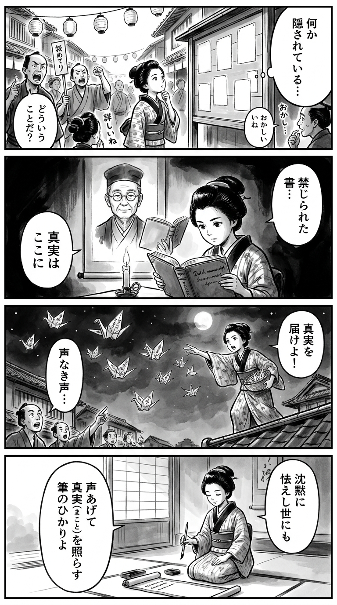

> **Language**: [日本語](../ja/書いてはいけない_review.html) | [English](../en/書いてはいけない_review.html) | [繁體中文](../zh-tw/書いてはいけない_review.html)
>
> [← Top / トップページ](../../)

# 書籍評論（繁體中文）

## 📖 書籍資訊
- **標題**: 書いてはいけない  
- **作者**: 森永 卓郎  
- **ASIN**: B0CWDJZJ5Z  
- **URL**: [https://www.amazon.co.jp/dp/B0CWDJZJ5Z](https://www.amazon.co.jp/dp/B0CWDJZJ5Z)  

---

<picture>
  <source srcset="../../images/reviews/書いてはいけない_4panel.webp" type="image/webp">
  
</picture>

## 對白

### Panel 1
**Scene**: 在繁忙的江戶街道上，紙燈籠高掛，新聞傳播者在大聲叫賣，町娘在一個公告板前停下，公告板上空白的地方應該貼滿了消息。她歪著頭，感覺到有什麼事情被隱瞞，周圍的市民低聲竊竊私語，氣氛既好奇又略顯不安。

### Panel 2
**Scene**: 在一個燭光閃爍的書房裡，町娘正在閱讀一本禁書，這本書是由一位看起來像森永拓郎的學者所寫——一位溫和的中年男子，戴著圓形眼鏡，表情冷靜而嚴肅，散發著安靜的反抗氣息。他的肖像出現在掛軸上，或像是一位教師般引導她，雖然話不多，但卻散發著道德的信念。墨影暗示著真相與沉默之間的重量。

### Panel 3
**Scene**: 在夜晚，町娘爬上屋頂，將折好的紙鶴撒向黑暗的天空，每隻紙鶴上都寫著真相的字句。下面的市民驚訝地仰望，當紙張在空中飄落。她堅定的臉龐在月光下閃耀，象徵著在他人沉默時勇敢發聲的勇氣。

### Panel 4
**Scene**: 曙光照耀著江戶，町娘跪在書桌前，手握毛筆，正在掛軸上寫一首短歌。她的表情平靜而堅定。短歌的內容是：

「沈黙に  
　怯えし世にも  
　声あげて  
　真実（まこと）を照らす  
　筆のひかりよ」

**Tanka (translation)**: 在這沉默而畏懼的世代，勇敢發聲，筆尖照亮真相的光芒。  
**Tanka (original)**: 沈黙に  
　怯えし世にも  
　声あげて  
　真実（まこと）を照らす  
　筆のひかりよ

## 🎯 本書的核心
《書いてはいけない》是末期癌症宣告的經濟分析師森永卓郎，賭上性命所寫的“對日本社會的遺書”。作者徹底揭露了媒體、官僚、政治和娛樂界之間的互相癒合，掩蓋真相的結構。

以傑尼斯事務所的性侵害問題、財務省的“邪教化”，以及日航123便墜毀事件為三個“禁忌”軸心，描繪了被恐懼和忖度支配的日本社會的真實面貌。作者通過自身的排除經歷，體現了報導的沉默如何侵蝕民主。

本書不僅僅是一本揭露書，更是一部質疑“說出真相的勇氣”的倫理書。對於選擇沉默的社會，作者呼籲“揭示真相才是獨立國家的第一步”。

---

## 💡 關鍵見解
- **恐懼與忖度的支配結構**  
  從傑尼斯事務所的權力結構到財務省的增稅信仰，所有共同點都是“以恐懼為支配”。作者敏銳地揭露了媒體在非直接壓力下，自主忖度而沉默的結構。

- **對財務省的“財務真理教”批評**  
  財務省將增稅自我目的化，優先考慮組織利益而非國民生活，描繪為“邪教化”。指出以宗教信念運營經濟政策的危險性，直擊官僚支配的本質。

- **日航123便事件與主權喪失的連鎖**  
  通過對官方說明的質疑，解讀戰後日本如何逐漸依附於美國。作者將此事件視為“奪走日本獨立的起點”，並主張真相的揭示是國家再生的關鍵。

- **媒體的沉默與民主的危機**  
  揭示因恐懼稅務調查或廣告壓力而導致的報導機構的結構性弱點，斷言沉默是權力的共犯行為。向讀者提出報導真相的倫理重擔。

- **賭上性命的真實記錄**  
  正如作者所寫“希望在有生之年完成這本書”，本書是個人堅定與使命感的結晶。在面對死亡的情況下，仍然抵抗沉默的人性尊嚴貫穿全書。

---

## 🔍 與現代背景的關聯
自本書出版以來，傑尼斯問題的再檢視、財務省的政策不信任，以及日航123便事件的討論再度升溫。在社交媒體和YouTube等非傳統媒體中，打破“沉默之牆”的行動正在擴展，森永的指摘可謂是預見了時代的脈動。

此外，2026年仍在書店持續缺貨的現象，反映出社會的不信任與對禁忌的高度關注。隨著媒體信任的動搖，個人選擇信息的能力＝媒體素養的重要性前所未有地提升。森永的揭發不僅僅是暴露，更是對強迫沉默結構的抵抗。

---

## 🚀 實踐建議
1. **具備識別報導沉默的視角**  
   專注於新聞中“未報導的部分”，有意識地識別信息的缺失和偏見，這是看穿支配結構的第一步。

2. **不輕信財務省的信息**  
   懷疑“增稅＝善”的固定觀念，保持自我學習經濟政策的態度。知識的自立將成為抵抗官僚支配的防波堤。

3. **支持要求信息公開的市民活動**  
   關注要求國家事件或公共資料公開的運動，擴大提高透明度的聲音，這將促進民主的健康發展。

4. **意識到支持獨立報導的機制**  
   為了支持不受廣告或稅務壓力影響的報導，應該支持獨立媒體或新聞基金等，個人的行動能改變社會。

5. **不讓打破沉默的個體孤立**  
   培養支持告發者和批判性言論者的文化，是保護自由公共空間的關鍵。應該建立社會支持勇敢發言的結構。

---

## ⭐ 總體評價
《書いてはいけない》是一本兼具勇氣切入禁忌與對沉默社會的尖銳批評的書。作者以面對死亡的筆觸，超越報導與政治的腐敗，提出“作為人應該如何說出真相”的根本性問題。

本書應該被不信任媒體和政治的讀者，以及所有不想成為“沉默共犯”的人閱讀。它是對讀者的覺悟與行動的促使，無疑是對現代日本的最後警告。

---

&copy; shioki | [CC BY-NC-SA 4.0](https://creativecommons.org/licenses/by-nc-sa/4.0/)
