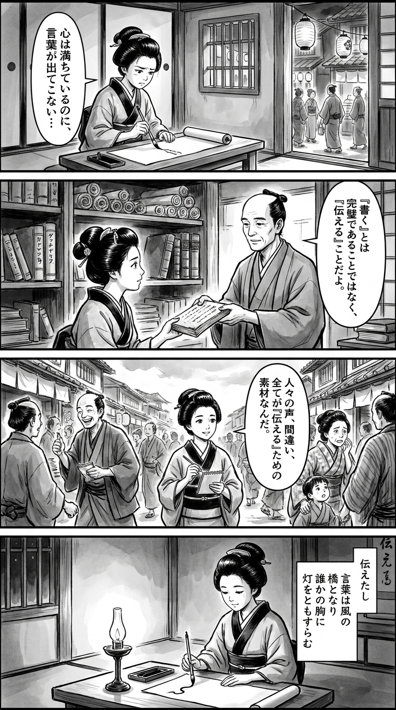

> **Language**: [日本語](../ja/書くのがしんどい_review.html) | [English](../en/書くのがしんどい_review.html) | [繁體中文](../zh-tw/書くのがしんどい_review.html)
>
> [← Top / トップページ](../../)

# 書籍評論（繁體中文）

## 📖 書籍資訊
- **標題**: 書くのがしんどい  
- **作者**: 竹村 俊助  
- **ASIN**: B08CKXKBFM  
- **URL**: [https://www.amazon.co.jp/dp/B08CKXKBFM](https://www.amazon.co.jp/dp/B08CKXKBFM)  

---

<picture>
  <source srcset="../../images/reviews/書くのがしんどい_4panel.webp" type="image/webp">
  
</picture>
## 🎯 本書的核心
《書くのがしんどい》是針對那些面臨「無法寫作」苦惱的人，揭示其根源在於「想要寫作」的意識。作者竹村俊助透過將寫作視為「傳達」的行為，來說明如何讓筆頭動起來。

本書重視的並非文章技巧，而是作為發信者的心態。在「寫出只有自己能寫的東西，讓每個人都能理解」的指導下，作者提議以日常的覺察和失敗為素材，享受試錯的過程。

此外，書寫被視為「編輯」的活動，強調擁有讀者視角的重要性。寫作不再是孤獨的工作，而是一種與他人對話、自我發現的過程。

---

## 💡 關鍵洞見
- **「傳達」的意識驅動筆觸**  
  無法寫作的人因為「想要寫作」而陷入完美主義。作者主張透過改變意識為「想要傳達」，筆頭自然會進展。這是一種以他者關係為核心的思維轉換，而非單純的自我表達。

- **負面經驗也可成為素材**  
  將情感的波動和失敗「昇華」，能夠產生引起共鳴的文章。透過寫作整理情感，並與他人分享，能同時實現自我療癒和社會連結。

- **像「漆塗」般重複書寫**  
  不要追求一次完美，而是透過多次重寫使文章更具深度。將寫作視為反覆和打磨的過程，能夠培養創作的持久力。

- **在「寫手」與「編輯」之間往返**  
  寫作時要無邪氣，閱讀時則要冷靜。透過在創造與批評之間切換，能夠兼顧客觀性與熱情，這是一種提升自我編輯能力的實用方法。

- **設計讀者的「閱讀理由」**  
  文章同時也是奪取讀者時間的行為。因此，誠實的寫作者應該意識到讀者「為何閱讀」，並明確表達信息的效用。

---

## 🔍 與現代文脈的關聯
在現代社會中，隨著社交媒體和商業文書的增加，人人皆成為「寫作的人」。然而，寫作疲勞和完美主義導致的心理障礙也日益嚴重。竹村的提議作為對這種「寫作文化過度化」的解方。

此外，隨著AI寫作工具的普及，「高效寫作」變得容易，但「用自己的語言傳達」的價值再次受到質疑。本書讓人重新確認在依賴科技的時代中，基於人類情感和經驗的發信意義。

將寫作視為「通過自己編輯世界的行為」，對於生活在分散型社會的個人來說，無論在創造性還是心理健康方面都是重要的指導。

---

## 🚀 實踐建議
1. **建立「素材本」**  
   養成記錄日常覺察和情感的習慣，自然會積累寫作素材。無需等待特別的經歷，觀察日常即是創作的第一步。

2. **使用語音輸入釋放思維**  
   不要過度思考，像說話一樣表達想法，能減輕寫作的心理負擔。避免完美主義，專注於「先表達」是關鍵。

3. **自問「也就是說？」「例如？」**  
   在抽象與具體之間往返，能增強文章的說服力。這是一種有效的自我編輯方法，亦可訓練結構能力。

4. **寫作時無邪氣，閱讀時冷靜**  
   在寫作階段要鼓勵自己，在回顧階段則要嚴格批評。這種雙重姿態是提升創作質量的關鍵。

5. **寫出「自己想讀的文章」**  
   不要過度關注他人，以自己的興趣和情感為出發點，最終會產生普遍的共鳴。相信自己的情感是被閱讀文章的源泉。

---

## ⭐ 總體評價
《書くのがしんどい》超越了文章技巧，將「寫作」與「生活」結合的思想書。對於所有面臨寫作苦惱的人，本書提供了視角的轉換和實踐的療癒。

本書將成為在寫作上感到困惑的商業人士、創作者，以及日常在社交媒體上發聲的人們的自我表達再出發點。透過寫作重新審視自己，並重新發現與他人連結的喜悅。

---

&copy; shioki | [CC BY-NC-SA 4.0](https://creativecommons.org/licenses/by-nc-sa/4.0/)
