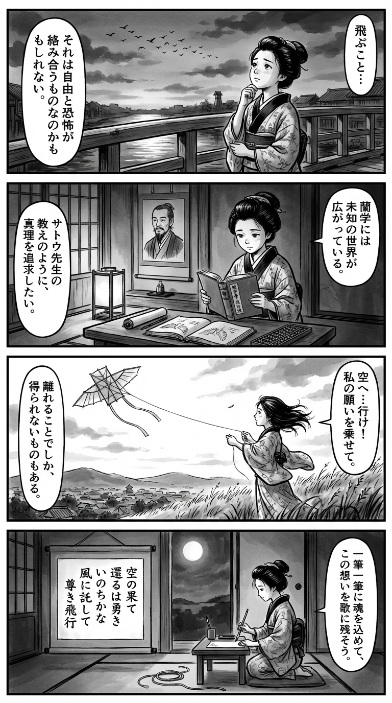

> **Language**: [日本語](../ja/最終飛行_review.html) | [English](../en/最終飛行_review.html) | [繁體中文](../zh-tw/最終飛行_review.html)
>
> [← Top / トップページ](../../)

# 書籍評論（繁體中文）

## 📖 書籍資訊
- **標題**: 最終飛行  
- **作者**: 佐藤 賢一  
- **ASIN**: B0DB7BCZ6X  
- **URL**: [https://www.amazon.co.jp/dp/B0DB7BCZ6X](https://www.amazon.co.jp/dp/B0DB7BCZ6X)  

---

<picture>
  <source srcset="../../images/reviews/最終飛行_4panel.webp" type="image/webp">
  
</picture>

## 對白

### Panel 1
**Scene**: 在黃昏的江戶，町娘站在橋上，凝視著飛向漸暗天空的候鳥。她低聲喃喃，思索著飛翔的感覺——自由與恐懼交織。河水映照著雲朵，喚起平靜與憂傷，她的表情充滿好奇與驚嘆。

### Panel 2
**Scene**: 在小書房裡，燈籠的光線照亮了町娘，她正在閱讀一本關於飛翔的荷蘭書籍，並在算盤旁邊素描鳥翼。書架上掛著一位學者的肖像，想像中的作者佐藤健一，描繪為一位冷靜、深思的中年男子，頭髮束起，鬍鬚整齊，目光穩重而智慧。他的存在感如同教師般，帶有哲學意味，彷彿在低語著尊嚴與創造的意義。

### Panel 3
**Scene**: 町娘將紙翼綁在竹風箏上，從俯瞰江戶的小山丘上放飛它。風箏高高飛起，隨著風顫抖。當它突破束縛，消失在雲中時，她靜靜地注視著，頭髮和袖子被同樣的風捲起——意識到飛翔既是追求，也是放手。

### Panel 4
**Scene**: 她跪在小書桌旁，手握毛筆，正在掛軸上寫作短歌。場景寧靜，月光透過障子灑下。風箏的線在她身旁，已被剪斷並捲起。短歌的內容是：

空的果  
還歸是勇者  
生命啊  
託於風中  
尊貴的飛行

## 🎯 這本書的核心
《最終飛行》透過聖修伯里的最後日子，探討在戰爭這一極限情境中「人類的尊嚴」與「創造的意義」。作為飛行員和作家的他，其生命被對祖國的愛與失落，以及孤獨創作的苦悶所貫穿。

佐藤賢一以歷史小說家的精緻筆觸，將聖修伯里的內心凝縮於「飛行」這一象徵性行為中。飛行不僅是與死亡並肩而行的行為，同時也是超越現實的精神嘗試。

本書雖然是戰爭文學，但同時也是一部探討「活著是什麼」與「創造是什麼」的哲學作品。讀者無法不將聖修伯里的最後飛行與自身生命的意義重疊。

---

## 💡 關鍵洞見
- **飛行是生命的隱喻**  
  飛行與著陸的描寫象徵著人生的高峰與終結。在空中時是自由的，但在回到地面的瞬間卻感受到失落。這種感受正是聖修伯里在預感生命終結時，仍然渴望飛翔的意志的表現。

- **文明的不對稱性考驗人性**  
  德國的壓倒性工業力量與法國的無力感對比，映射出現代文明中「人類價值的喪失」。在技術進步超越人性之時，聖修伯里堅定地說「飛機就是飛機」，探索人類感知與技術的和諧。

- **對虛假和平的批判**  
  里斯本的明亮背後潛藏著「大家都假裝不知道」的描寫，揭示了現實逃避的危險。對戰爭視而不見的社會，最終會失去自身的尊嚴。

- **理解而非破壞才是戰鬥**  
  偵察飛行的「觀察任務」是拒絕破壞精神的象徵。對聖修伯里而言，戰鬥並非殺死敵人，而是理解世界的行為本身。

- **接受死亡與超越**  
  「已經死了嗎？」的獨白顯示，死亡並非恐懼，而是歸返。他的最後飛行意味著在失敗的盡頭找到精神自由的到達。

---

## 🔍 與現代背景的關聯
在現代社會中，「技術與人性之間的關係」、「現實逃避與責任迴避」依然是重要的主題。隨著人工智慧和自動化的進步，人類的判斷與倫理定位正受到動搖，這與聖修伯里所面臨的「工業文明與人類尊嚴」的問題息息相關。

此外，隨著民粹主義和社會分裂的擴大，「大家都假裝不知道」的情況再次出現。《最終飛行》中所描繪的「直視現實的勇氣」，可以視為對於假新聞與冷漠蔓延的現代警鐘。

更進一步，隨著太空與航空技術再次受到關注，聖修伯里的「飛行＝理解的行為」的思想，對於考量技術的倫理運用具有啟發意義。他的飛行也是對現代科技社會中「人類重新定義」的提問。

---

## 🚀 實踐建議
1. **擁有直視現實的勇氣**  
   在困難的情況下，面對現實是保護尊嚴的第一步。在社會問題和個人衝突中，保持「不假裝不知道」的姿態是重要的。

2. **透過創造重新審視自我**  
   正如聖修伯里在苦悶中持續創作，創作是自我理解的手段。寫作、繪畫等表達方式能夠促進與內心的對話，進而帶來再生。

3. **將人性帶回技術中**  
   使用機器或人工智慧時，切勿忘記「這是否能使人幸福」的視角。技術不是目的，而是人類延伸的手段。

4. **以理解的態度與他人互動**  
   即使言語不通，努力理解的姿態能夠深化關係。應該重視「理解」而非「改變」他人。

5. **不懼怕死亡，活出生命的真諦**  
   意識到有限性使日常選擇更具誠實感。接受死亡的覚悟將帶來更深刻的生命體驗。

---

## ⭐ 總體評價
《最終飛行》是一部超越戰爭文學的「人類存在的哲學書」。透過聖修伯里的生與死，讀者面對「活著是什麼」與「創造是什麼」的根本問題。

佐藤賢一的筆觸描繪出超越史實的靈魂軌跡。雖然描繪了戰爭的悲劇，但本書不失希望與尊嚴，正是當今不安與分裂時代中值得一讀的作品。

---

&copy; shioki | [CC BY-NC-SA 4.0](https://creativecommons.org/licenses/by-nc-sa/4.0/)
