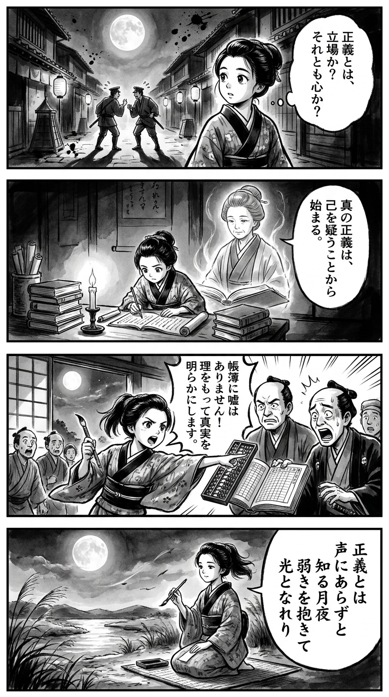

> **Language**: [日本語](../ja/月下のサクラ_review.html) | [English](../en/月下のサクラ_review.html) | [繁體中文](../zh-tw/月下のサクラ_review.html)
>
> [← Top / トップページ](../../)

# 書籍評論（Markdown・繁體中文）

## 📖 書籍資訊
- **標題**: 月下のサクラ  
- **作者**: 柚月裕子  
- **ASIN**: B0CV41TM34  
- **URL**: [https://www.amazon.co.jp/dp/B0CV41TM34](https://www.amazon.co.jp/dp/B0CV41TM34)  

---

<picture>
  <source srcset="../../images/reviews/月下のサクラ_4panel.webp" type="image/webp">
  
</picture>

## 對白

### Panel 1
**Scene**: 町娘在夜晚的江戶街道上行走，明亮的滿月高懸。她聽見兩名警察在爭論「正義」和「命令」，眼中流露出好奇，心中思索著：「正義是由地位決定的，還是由內心決定的？」街燈閃爍，投下長長的陰影，暗示著未見的衝突。

### Panel 2
**Scene**: 在家中，她在燭光下學習。從她的荷蘭和中文書籍中，想像中的導師顯現出來——一位五十多歲的冷靜知性女性，表情溫和而堅定，髮型簡單的髻，穿著學者的長袍。這個形象體現了作者柚月裕子所散發的氣質：端莊、深思且內斂堅強。她透過書頁對町娘說：「真正的正義始於你敢於質疑自己。」

### Panel 3
**Scene**: 第二天，町娘介入商人與濫用權力的官員之間的爭執。她運用理智和算術揭示帳目真相，令所有人驚訝。構圖充滿動感——她的袖子在指向帳本時飄動，月光微弱地透過紙窗，象徵著道德的清晰穿透黑暗。

### Panel 4
**Scene**: 後來，她在同樣的月光下，跪在河邊，手持毛筆，正在短冊上作和歌。風吹動蘆葦，她的表情既平靜又堅定。寫在垂直的日文文本中的短詩如下：

正義とは  
声にあらずと  
知る月夜  
弱きを抱きて  
光となれり  

**Tanka (translation)**: 正義不是僅僅靠聲音來決定的，這是月夜下的認知，擁抱弱者，成為光明的象徵。  
**Tanka (original)**: 正義とは  
声にあらずと  
知る月夜  
弱きを抱きて  
光となれり

## 🎯 這本書的核心
《月下のサクラ》是一部社會派警察小說，以女性刑警泉的成長為主軸，探討在男性主導的警察社會中堅持信念的意義。泉以語言能力和觀察力為武器，追求自己的正義，並在組織邏輯與個人倫理之間掙扎。

故事描繪了堅持信念的尊貴與危險，以及「正義」這個詞有時會合理化暴力和腐敗的風險。透過與師父黑瀬的關係，泉學會了「以行動示範」的領導力，最終達到接受自己弱點的力量。

柚月裕子真實地描繪了警察組織的封閉性和人性的脆弱，向讀者提出了正義是什麼、信念是什麼的普遍性問題。

---

## 💡 關鍵見解
- **信念驅動人心**  
  泉的行動原則在於「堅持自己所信仰的力量」。信念而非技術或地位，才是支持人們、克服困難的動力。

- **組織的腐敗始於上層**  
  黑瀬的話「上層享受安逸，下層便會模仿」揭示了領導者的態度如何規範整個組織的現實。倫理的崩潰始於上層的懈怠，這是一個警鐘。

- **努力超越環境**  
  泉自學語言的描寫象徵著不以環境為藉口，通過自身努力開創道路。努力的方向決定了人生的走向。

- **以正義之名進行的暴力的危險**  
  透過公安的行為，描繪了國家或組織所宣揚的「大義」如何矛盾地奪走個人生命。泉的信念「人絕對不應該奪走他人的生命」成為倫理的最後防線。

- **接受弱點的勇氣**  
  如同「不必再努力了」這句話所象徵的，承認極限並非失敗。接受人性的弱點是通往真正重生與成長的第一步。

---

## 🔍 與現代背景的關聯
本作的主題與現代社會面臨的「組織的正義與個人倫理的衝突」深刻共鳴。在警察、行政和企業中接連發生的醜聞中，組織的自保與個人信念的對立成為現實問題。

此外，泉這位女性刑警的存在象徵著在男性主導的組織文化中女性的職業發展。即使制度上平等有所進展，實質上的差距和同調壓力依然存在，泉的奮鬥引起了許多讀者的共鳴。

再者，地方社會的封閉性以及對透明度和問責制的社會要求的提升也與之共鳴。《月下のサクラ》不僅僅是一部警察小說，更是一面映照現代日本倫理課題的鏡子。

---

## 🚀 實踐建議
1. **明確信念並付諸行動**  
　清楚地用語言表達自己所信仰的價值，能在困難情況下保持判斷的軸心。像泉一樣，將信念轉化為具體行動是重要的。

2. **領導者以身作則**  
　如同黑瀬的態度所示，行動比言語更能建立信任。對部下和同事誠實地行動，能支撐組織的倫理。

3. **不以環境為藉口，自我提升所需的能力**  
　如泉自學語言般，超越環境限制需要主動學習和持續努力。

4. **質疑正義，重新思考倫理**  
　持續自問「在大義名分下是否犧牲了某人」是保護個人倫理的關鍵。

5. **分享弱點，建立互助關係**  
　承認極限並非恥辱。接受彼此的弱點，能為組織和個人帶來重生的力量。

---

## ⭐ 總體評價
《月下のサクラ》超越了警察小說的範疇，鋭利地描繪了現代社會的倫理困境。柚月裕子的筆觸冷靜而充滿熱情，透過角色的信念與掙扎，提出了「正義是什麼」的根本性問題。

特別是作為女性刑警的泉的成長故事，給予讀者強烈的共鳴與勇氣。對於所有在組織中堅持自己信念的人來說，本作提供了深刻的啟示與鼓勵。

---

&copy; shioki | [CC BY-NC-SA 4.0](https://creativecommons.org/licenses/by-nc-sa/4.0/)
