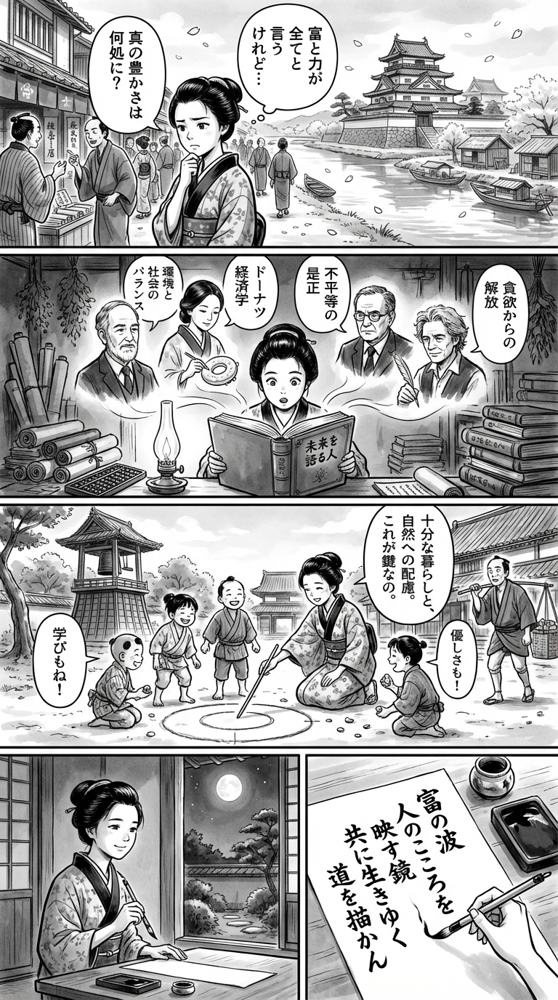

> **Language**: [日本語](../ja/未来を語る人（インターナショナル新書）_review.html) | [English](../en/未来を語る人（インターナショナル新書）_review.html) | [繁體中文](../zh-tw/未来を語る人（インターナショナル新書）_review.html)
>
> [← Top / トップページ](../../)

# 書籍評論（Markdown・繁體中文）

## 📖 書籍資訊
- **標題**: 未来を語る人（インターナショナル新書）  
- **作者**: ジャレド・ダイアモンド, ブランコ・ミラノヴィッチ, ケイト・レイワース, トーマス・セドラチェク, レベッカ・ヘンダーソン, ミノーシュ・シャフィク, アンドリュー・マカフィー, ジェイソン・Ｗ・ムーア, and 大野和基  
- **ASIN**: B0CLN2WDJB  
- **網址**: [https://www.amazon.co.jp/dp/B0CLN2WDJB](https://www.amazon.co.jp/dp/B0CLN2WDJB)  

---

<picture>
  <source srcset="../../images/reviews/未来を語る人（インターナショナル新書）_4panel.webp" type="image/webp">
  
</picture>

## 對白

### Panel 1
**Scene**: 在繁忙的江戶街道上，町娘停在一個商人的攤位前，攤位上展示著進口的卷軸。她聽到周圍的人們在辯論「財富與權力主宰一切」，她皺起眉頭，若有所思地望著映照著豪宅和小船的河流。櫻花瓣隨風飄落，她輕聲自語：「還有其他衡量繁榮的方法嗎？」

### Panel 2
**Scene**: 在一個昏暗的書房裡，四周擺滿了卷軸和算盤，她打開一本名為《未來を語る人》的荷蘭書籍。書頁中浮現出智慧的身影——世界思想家的想像肖像：賈雷德·戴蒙德是一位有著平靜眼神的鬍鬚學者，凱特·拉沃斯是一位安靜的女性，正在勾勒一個圓形的「甜甜圈」圖，布蘭科·米拉諾維奇是一位戴著眼鏡的嚴肅數學家，而托馬斯·塞德拉切克則是一位頭髮凌亂、手持羽毛筆的哲學家。他們的幽靈形象在燈光下與町娘交談，町娘驚訝地傾聽。

### Panel 3
**Scene**: 在黎明時分，她在寺廟的院子裡召集鄰里的孩子們，用棍子在沙地上畫出一個圓形圖表，解釋「人人夠用」和「關心自然」之間的平衡是關鍵。孩子們笑著，為「善良」和「學習」添加小石子。一位商人聽見了，停下腳步，感到好奇。町娘的眼中閃爍著堅定的光芒——她將抽象的理論轉化為了活生生的實踐。

### Panel 4
**Scene**: 在靜謐的黃昏光線中，町娘坐在窗邊，筆架在一片和紙上。她凝視著映在墨石中的月亮，輕輕微笑，寫下了一首體現書本精神的和歌。最後一個畫面集中在她的手和完成的詩上，墨水仍然閃閃發光：
**Tanka (translation)**: 財富的波浪，映照著人心的鏡子，讓我們共同描繪生活的道路。
**Tanka (original)**: 「富の波  
人のこころを  
映す鏡  
共に生きゆく  
道を描かん」

## 🎯 這本書的核心
《未来を語る人》是一本直面現代資本主義的極限與民主主義的危機，試圖重新設計經濟、社會與環境的知識對話集。全球知名思想家如ジャレド・ダイアモンド和ケイト・レイワース等，跨越氣候變遷、貧富差距、倫理等主題進行討論。

本書的核心議題是「資本主義與民主主義的重建」。它超越了成長至上的思維，探索像是甜甜圈經濟這樣的可持續框架，描繪人類與自然、財富與倫理之間的新關係。

此外，本書還提出了疫情後社會契約的重建、性別平等的推進、以及科技帶來的去物質化等未來社會的具體方向，這些都是本書的獨特之處。儘管是一本思想書，但它同時充滿了現實的建議，可以視為「未來的設計圖」。

---

## 💡 關鍵見解
- **資本主義的失控與民主主義的空洞化**  
  對於財富集中如何支配政治與媒體，並動搖民主主義根基的現狀進行了尖銳的分析。書中暗示，急需設計制度來控制資本的力量，恢復公共性。

- **透過甜甜圈經濟建立新的價值標準**  
  提議應該擺脫將GDP成長視為唯一目標的經濟觀，導入新的指標來衡量社會與環境的健全性，這促進了經濟教育的重建。

- **科技與去物質化的希望**  
  能源效率和可再生能源的進步顯示了在減少資源消耗的同時維持富裕的可能性。倫理性地利用技術創新的視角至關重要。

- **社會契約的重建與代際公平**  
  基於疫情暴露的社會脆弱性，必須重新設計教育、醫療與福利。特別是對年輕人的投資與公平的稅制，將形成持續社會的基礎。

- **倫理與故事的重生**  
  要求將經濟重新定義為人類的倫理行為，而非單純的效率體系。恢復人們共同能夠相信的「故事」，將支撐未來的希望。

---

## 🔍 與現代背景的關聯
本書的討論與當代社會中「價值觀不一致」和「幸福感下降」等議題密切相關。在成果主義和重視速度的文化壓迫人性之際，轉向可持續且包容的社會成為當前的需求。

此外，教育界對個別最佳化學習和專案型學習的重視，催生了「關係知識」和「社會貢獻導向的教育」等新潮流，這與本書所提倡的「新社會契約」相呼應。

隨著氣候危機和多元文化共生的問題逐漸現實化，本書主張重新定義人與自然、社會與經濟的關係，正是2020年代全球性課題的直接反映。

---

## 🚀 實踐建議
1. **導入新的經濟指標**  
   將環境、社會與幸福度的指標納入政策判斷，而非僅僅依賴GDP。這將有助於實現經濟成長與可持續性的雙贏社會。

2. **進行教育的長期投資**  
   擴大從幼年到終身的教育投資，以縮小貧富差距。特別是重視數位素養與倫理教育，以培養能夠應對未來社會的人才。

3. **將企業的目的從「利潤」轉向「社會價值」**  
   重新設計企業活動，使其基於倫理與社會目的，實踐利益相關者資本主義。這將使企業成為社會變革的推動者。

4. **推動性別平等的制度改革**  
   促進配額制和男性參與育兒，糾正勞動市場中的性別差距。支持多樣化的工作方式的制度將提升整個社會的活力。

5. **推進公平的稅制與國際協調**  
   廢除避稅天堂，設定全球最低企業稅率，以實現財富的再分配。這將有助於恢復社會契約的信任。

---

## ⭐ 總體評價
《未来を語る人》不僅僅是一本未來預測書，而是挑戰「如何重建一個人性化社會」這一根本問題的思想書。雖然各論者的觀點不同，但共同追求倫理、自然與人性的恢復，讓人感受到深刻的共鳴。

本書同時提出結構性分析與希望的願景，正是對現代社會的不安與困境的最佳回應。對於經濟學家、企業家、教育者，以及所有認真思考未來的讀者來說，這都是一本必讀之作。

---

&copy; shioki | [CC BY-NC-SA 4.0](https://creativecommons.org/licenses/by-nc-sa/4.0/)
