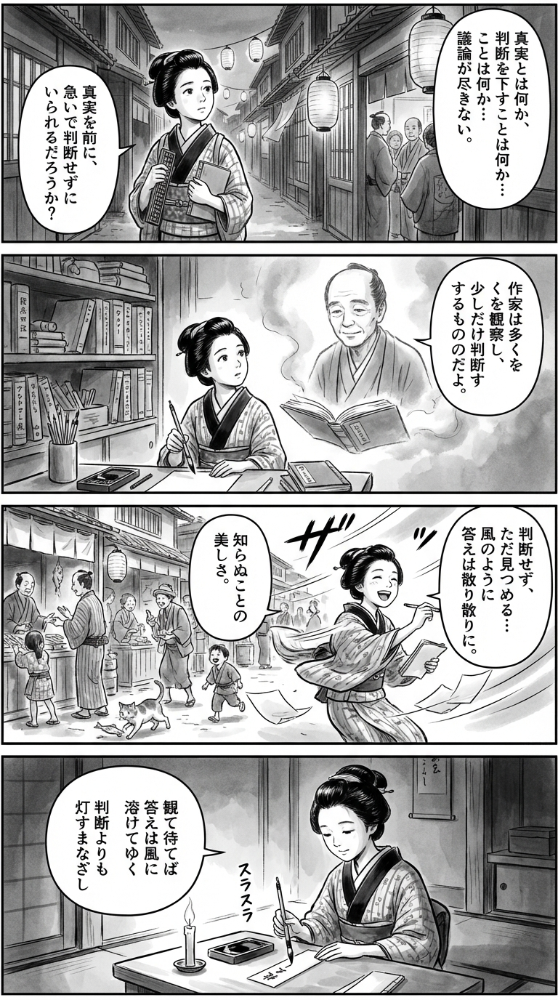

---
---
> **Language**: [日本語](../ja/村上春樹 雑文集（新潮文庫）_review.html) | [English](../en/村上春樹 雑文集（新潮文庫）_review.html) | [繁體中文](../zh-tw/村上春樹 雑文集（新潮文庫）_review.html)
>
> [← Top / トップページ](../../)

## 📖 書籍資訊
- **書名**: 村上春樹 雜文集（新潮文庫）  
- **作者**: 村上春樹  
- **ASIN**: B08BNNY877  
- **URL**: [https://www.amazon.co.jp/dp/B08BNNY877](https://www.amazon.co.jp/dp/B08BNNY877)  

---

## 對白

### Panel 1
**Scene**: 傍晚的江戶小巷靜靜延展，町娘手抱算盤與筆記本漫步其中。她在紙燈籠店前停下，聽見人們激烈爭論「真理」與「判斷」。燈籠的光搖曳，她的神情變得沉思——如何才能在不急於下定論的情況下，看見真實？  
**Dialogue**: （心想）「若不急著判斷，真理是否會自己浮現呢……」

### Panel 2
**Scene**: 夜裡的小書齋裡，書架上擺滿了蘭學與和書。町娘翻閱著一冊從海外傳來的隨筆集。書頁間的墨霧中，浮現出一位中年男子的身影——溫和的眼神、沉靜的氣息，彷彿是思想的化身。他身著簡樸長袍，語氣平靜而溫柔。  
**Dialogue**: 「作家觀察許多，卻少下判斷。」  
町娘凝神聆聽，筆尖停在半空。

### Panel 3
**Scene**: 清晨的市集熱鬧非凡——商人討價還價、孩童嬉笑、流浪貓叼走魚。町娘靜靜觀察，不插手、不評斷，只在紙上記錄。忽然一陣風起，吹散了她的紙張。她笑了，感受到「不知」之美。畫面以強烈的斜線筆觸描繪風的動勢，髮絲與袖口隨風飛揚。  
**Dialogue**: 「原來，風也會替我寫詩呢。」

### Panel 4
**Scene**: 夜裡，她坐在燭光下的書案前，提筆在短冊上寫下和歌。室內一片靜謐，只有筆尖摩擦紙面的聲音。她的神情安然，帶著覺悟與謙遜的光。  
**Dialogue**: （低語）「觀而待，心自明。」  
**Tanka (translation)**:  
靜觀而待，  
答案融入風中；  
比起判斷，  
更珍貴的是那  
能點亮的目光。  
**Tanka (original)**:  
観（み）て待てば  
答えは風に  
溶けてゆく  
判断よりも  
灯すまなざし

## 🎯 本書核心
《村上春樹 雜文集》是一部凝縮了作家倫理觀、文學使命與人類尊嚴思索的隨筆集。村上將小說家定義為「觀察很多、判斷很少的人」，並主張文學的核心在於從觀察中誕生的真實描寫。  

對他而言，虛構並非逃避現實的手段，而是一種照亮現實的「白魔法」，透過故事守護人類尊嚴的行為本身。文學雖無即效性，卻是一種長期支撐人類倫理與自由的「持續性實踐」。  

此外，在耶路撒冷獎演講中以「牆與蛋」為象徵的比喻，展現了村上始終站在個人靈魂一方、抗拒體制暴力的姿態。這種思想透過「觀察・假設・持續」三原則，靜靜地質問文學對社會與人類應負的角色。  

---

## 💡 關鍵洞見
- **觀察與判斷的平衡是創作的核心**  
  村上認為「觀察是接近真實的唯一方法」。過於急於下判斷會限制故事的可能性，唯有不斷觀察，才能描繪現實的複雜性。

- **虛構是理解現實的裝置**  
  小說並非逃避，而是一種照亮現實的「假設實驗裝置」。讀者透過虛構重新建構自我與社會的關係，並鍛鍊倫理性的想像力。

- **文學的價值在於持續性**  
  村上注意到文學從未孕育出戰爭或暴力，並將文學的力量視為「守護人類尊嚴的長期倫理」。這份靜默的持續性，正是文學存在於社會的理由。

- **「牆與蛋」所展現的倫理立場**  
  村上宣示自己永遠站在脆弱的個人——也就是「蛋」的一方。這象徵他作為作家，面對龐大體制與權力時，守護個人靈魂的明確道德立場。

- **共享「沒有結論」的誠實**  
  面對現實的複雜性，不輕易給出答案，而是共享「困惑」的態度，正是人性誠實的證明。文學也是一個讓人們共同生活於這份「困惑」中的場域。

---

## 🔍 與現代脈絡的關聯
在現代社會中，疫情後的孤立與心理健康危機日益嚴重。村上的「牆與蛋」比喻，象徵了被社群媒體與系統包圍的現代人孤獨，以及試圖掙脫的個人掙扎。  

此外，他所談的「觀察與沒有結論」提醒我們，在資訊過剩的時代，保持不被即時判斷與輿論裹挾的重要性。他的文學態度，也被重新評價為對抗 AI 時代「自動化判斷」的人類智慧典範。  

再者，村上透過音樂與翻譯展現的跨文化感受力，在全球化與無國籍化加速的今日，成為恢復對他者共感的重要途徑。這本隨筆集為孤立的個人提供了重新發現「共享故事」的指引。  

---

## 🚀 實踐建議
1. **避免急於判斷，深化觀察**  
   在日常中避免即時下結論，細緻觀察事物，能獲得更多層次的理解。這不僅適用於創作，也可應用於人際關係與工作。

2. **培養累積假設的思考方式**  
   在得出結論前，先建立假設並反覆驗證。村上所說的「假設的累積」，是一種培養創造性思維的實踐方法。

3. **透過虛構相對化自我**  
   接觸多樣的故事，有助於相對化自身價值觀與立場，培養更靈活的視角。小說是理解現實的一面鏡子。

4. **嘗試共享「沒有結論」的對話**  
   不急於求解，而是共同面對「困惑」。這是誠實溝通的第一步，也是理解他者的基礎。

5. **磨練翻譯文化的感性**  
   以自己的語言重新詮釋音樂與文學，能培養理解他者表達的能力，這是提升創造性理解力的最佳訓練。

---

## ⭐ 總體評價
《村上春樹 雜文集》是一部正面探問作家倫理與文學使命的靜謐而有力的思想之書。它不僅談論小說家的內在倫理，也提出了守護現代社會中「個人尊嚴」的普遍哲學。  

這本書不僅適合立志創作的人，也推薦給所有想在資訊氾濫時代重新找回「觀察力」的讀者。讀完後，世界的景象將變得更為寧靜，思考中也會多出一份重視理解而非判斷的餘白。

---

&copy; shioki | [CC BY-NC-SA 4.0](https://creativecommons.org/licenses/by-nc-sa/4.0/)
