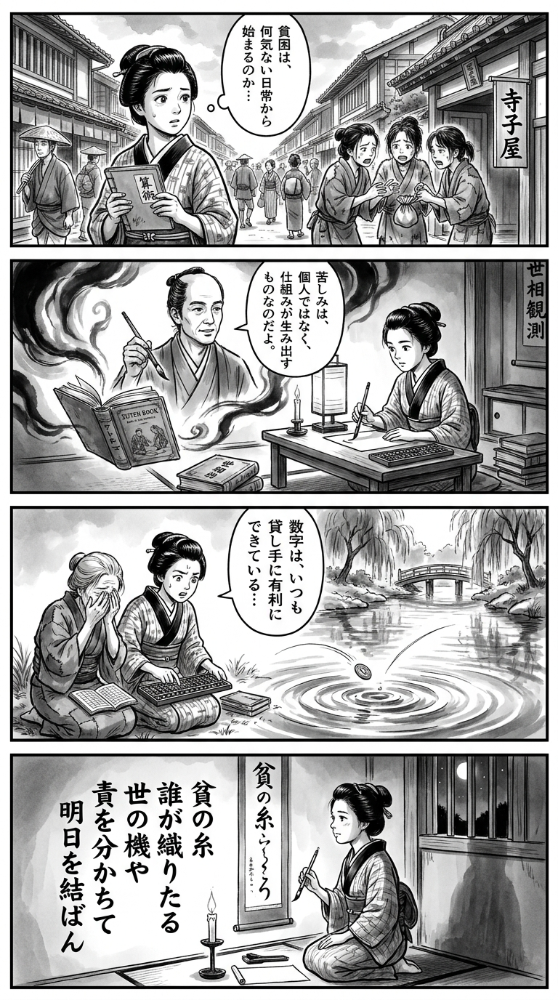

> **Language**: [日本語](../ja/東京貧困女子。―彼女たちはなぜ躓いたのか_review.html) | [English](../en/東京貧困女子。―彼女たちはなぜ躓いたのか_review.html) | [繁體中文](../zh-tw/東京貧困女子。―彼女たちはなぜ躓いたのか_review.html)
>
> [← Top / トップページ](../../)

# 書籍評論（繁體中文）

## 📖 書籍資訊
- **標題**: 東京貧困女子。―她們為什麼會跌倒  
- **作者**: 中村 淳彦  
- **ASIN**: B07NGX9JFX  
- **URL**: [https://www.amazon.co.jp/dp/B07NGX9JFX](https://www.amazon.co.jp/dp/B07NGX9JFX)  

---

<picture>
  <source srcset="../../images/reviews/東京貧困女子。―彼女たちはなぜ躓いたのか_4panel.webp" type="image/webp">
  
</picture>

## 對白

### Panel 1
**Scene**: 在繁忙的江戶街道上，町娘注意到一群年輕女性正在為寺廟學校的學費而苦惱。她停下來，手中握著算術筆記本，眼中流露出擔憂。背景顯示狹窄的小巷和樸素的長屋，喚起日常生活的脆弱感。她的思考泡泡反映出她對“貧困”可能從普通生活開始的擔憂。

### Panel 2
**Scene**: 在一個昏暗的書房裡，她打開一本荷蘭書籍和一卷社會觀察的卷軸，卷軸上似乎是學者中村篤彦的肖像——想像中的他是一位冷靜的中年男子，眼神深思，頭髮束起，穿著簡單的袍子，表情分析卻充滿同情。他的肖像似乎從書頁中浮現，像是在教導她如何是制度而非個人造成了痛苦。町娘專心地傾聽，手中握著毛筆。

### Panel 3
**Scene**: 在河邊，她使用算盤和筆記幫助一位寡婦計算債務，發現數字總是偏向貸方。驚訝之下，她將一枚硬幣掉入河中，水波在面板上擴散——象徵著社會中看不見的枷鎖。她的臉上流露出既驚訝又平靜的憤慨。

### Panel 4
**Scene**: 在她的小房間裡，燭光照亮了夜晚。她跪著，手中握著毛筆，正在掛軸上作和歌。蠟燭微微閃爍，她凝視著窗外，眼神堅定卻又帶著淡淡的惆悵。短詩如下：

貧の糸  
誰が織りたる  
世の機や  
責を分かちて  
明日を結ばん

## 🎯 本書的核心
本書是對現代日本都市中生活的年輕女性如何被捲入貧困連鎖的深入社會報導。作者中村淳彦採訪了風俗業、非正規雇用、學貸償還、護理工作等現場，揭示了制度性結構如何逼迫「普通女性」。  

透過每位受訪者的證言，作者揭露了被「自我責任」這個詞所掩蓋的現實。浮現出來的是，國家政策和社會制度在不知不覺中再生產貧困的嚴酷事實。本書強烈地提出了將貧困視為「個人失敗」而非「社會設計失誤」的重新思考。  

---

## 💡 關鍵見解
- **學貸制度是債務結構而非支援**  
　揭露接受教育等同於背負債務的現實。以學貸制度之名，年輕人被經濟束縛，社會不平等在他們進入社會前就已經固定化。  

- **性工作是經濟結構中最底層的勞動**  
　提供將風俗產業視為經濟生存策略而非道德問題的視角。數萬元的不足使女性走向夜生活的現實，清楚顯示了社會安全網的缺失。  

- **官製的工作貧窮侵蝕國家的倫理**  
　指出地方政府職員和社會工作者陷入貧困的矛盾，揭露制度根基中的剝削結構。公營機構主動使低工資勞動常態化，從根本上動搖了國家的信任。  

- **「無緣社會」使貧困固定化**  
　家庭、社區和制度的三重斷裂，造成無法獲得支援的孤立。在社會聯繫日益薄弱的情況下，貧困不再是個人的問題，而是結構性孤立的結果。  

- **「自我責任」論隱瞞社會暴力**  
　在談論貧困時，主導的言論「自我責任」使結構性不公無法被看見。作者批評這個詞，呼籲整個社會承擔「共同責任」。  

---

## 🔍 與現代文脈的關聯
本書所描繪的問題在2020年代的日本社會中依然嚴重。非正規雇用率上升、房租高漲、學貸償還負擔，以及單身女性的貧困率高企，這些問題在東京周邊持續擴大。特別是在疫情之後，女性失業和孤獨死亡的增加已成為社會問題，本書的觀察愈加真實。  

此外，在護理和社會福利領域，「成就剝削」和人力不足已成常態，年輕人的勞動環境未見改善。中村所描繪的「官製貧困」，如今被視為侵蝕社會基礎的結構性問題。本書是對當代社會扭曲的早期警鐘，具有前瞻性的作品。  

---

## 🚀 實踐建議
1. **學習學貸制度的實態，呼籲給付型支援**  
　為了將教育視為「權利」，需要擴大對制度透明化的市民討論。  

2. **要求企業和政府改善非正規雇用**  
　以「能過上最低限度生活的工資」為基準，要求制度改革以保護勞動者的尊嚴，這將有助於社會整體的穩定。  

3. **重建社區的互助網絡**  
　為了防止孤立，參與社區支援團體或志願者活動，有助於緩解社會孤立。  

4. **持有「共同責任」的視角，而非「自我責任」**  
　應該理解困窮者的問題是制度和社會結構的問題，而非單純的個人責任。  

5. **使福祉和護理現場的聲音可見**  
　將現場工作者的聲音傳遞到社會，並反映在政策形成中，這是防止制度疲勞的第一步。  

---

## ⭐ 總體評價
《東京貧困女子。》是可視化現代日本「看不見的貧困」的社會報導的金字塔。中村淳彦透過受訪者的聲音，冷靜地描繪出貧困結構如何奪走女性的生活。  

本書要求讀者直視社會制度的疲勞，同時提出「認真生活的人應該得到回報的社會是什麼」的根本性問題。無論是對社會問題感興趣的讀者，還是從事教育、行政和福祉工作的人，這都是一本必讀的書籍。

---

&copy; shioki | [CC BY-NC-SA 4.0](https://creativecommons.org/licenses/by-nc-sa/4.0/)
