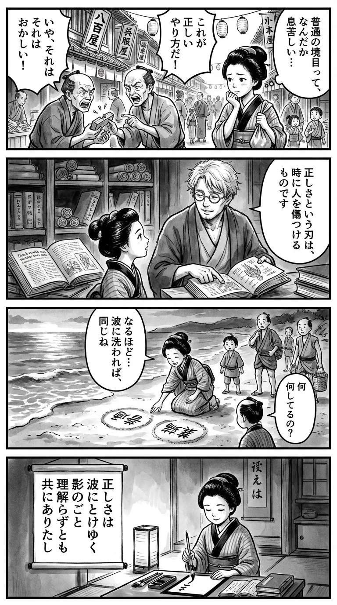

> **Language**: [日本語](../ja/正欲_review.html) | [English](../en/正欲_review.html) | [繁體中文](../zh-tw/正欲_review.html)
>
> [← Top / トップページ](../../)

# 書籍評論（Markdown・繁體中文）

## 📖 書籍資訊
- **標題**: 正欲  
- **作者**: 朝井リョウ  
- **ASIN**: B08XX6LHQX  
- **URL**: [https://www.amazon.co.jp/dp/B08XX6LHQX](https://www.amazon.co.jp/dp/B08XX6LHQX)  

---

<picture>
  <source srcset="../../images/reviews/正欲_4panel.webp" type="image/webp">
  
</picture>
## 🎯 這本書的核心
《正欲》是一個從根本上質疑社會所定義的「正確性」、「正常」、「愛」和「性」等框架的故事。朝井リョウ揭示了站在社會「正常岸邊」的人們無意識地進行排除的結構，並描繪了潛藏其中的暴力性。  

登場人物們承載著無法被理解的欲望和孤獨，卻透過「不會消失」這個小小的約定來連結生命。即使未被理解，彼此共存的姿態成為對現代社會「共感疲憊」的靜默反抗。  

本書是一個超越「為了不死而活」的現代絕望，試圖重新找回「活著」本身的文學實驗。  

---

## 💡 關鍵見解
- **「正確性」會變成暴力**  
  社會所宣揚的「健康」和「正義」往往作為排除異質存在的工具。朝井將這一結構描繪為日常生活中無意識進行的「排除快感」，使讀者重新審視自身的立場。

- **欲望是人類的根本**  
  性取向和戀物癖不僅僅是性行為，而是與思考、哲學和人際關係的根基息息相關。本書訴說社會否定這些的行為等同於否定個人的存在。

- **「正常」的幻想**  
  持續屬於多數派只是一種偶然的產物，穩定的「正常性」並不存在。朝井將這種脆弱性可視化，並向讀者提出「正常」一詞的危險性。

- **共存重於理解**  
  登場人物們雖然放棄了完全理解彼此的想法，但透過「不會消失」的存在保證而相互連結。與無法理解的他者共同生活，才是真正的共感形式。

- **肯定孤獨**  
  帶著他人無法理解的孤獨生活，絕不是失敗。相反，這是一種保持自我輪廓、與他者共存的靜謐幸福形式。  

---

## 🔍 與現代文脈的關聯
《正欲》所描繪的「無法被理解的欲望」和「排除結構」，尖銳地批判了2020年代多樣性社會的表面接受。在社交媒體時代，只有「可共感的差異」受到歡迎，而「難以理解的欲望」則被推向看不見的角落。朝井用文學的語言將這一現實可視化。  

此外，與同時代的「推し活」和「陰謀論」等現象相連，個人沉浸於自己所信仰的故事中。在社會只接受「可共感的故事」的情況下，人們愈發孤立，閉塞於自我完結的世界。《正欲》提前預見了這種危險，質疑我們該如何與「無法理解的他者」共同生活。  

---

## 🚀 實踐建議
1. **質疑自己的「正確性」**  
   在日常生活中，有意識地檢視自己的常識和倫理觀是否在排除他人。在以正義之名斷罪他人之前，重新審視其背後的結構。

2. **與無法理解的他者共處**  
   練習不排除無法理解的他者，接受與其共同存在的事實。追求「共存」的姿態將成為支持多樣性社會的基礎。

3. **不否定孤獨**  
   將孤獨視為「前提」而非「缺陷」來接受。與他者互動時，即使懷抱孤獨，亦能產生真正的連結。

4. **廣泛理解「性」的概念**  
   不將性取向或欲望視為「異常」，而應理解其為人類根本的表達。這是尊重他者的最實踐倫理。

5. **傾聽未被表達的聲音**  
   將目光投向社會中被視為「錯誤」的人們的沉默。將他們的存在視為社會忽略的現實，而非異常，這是共感的第一步。  

---

## ⭐ 總體評價
《正欲》揭示了現代社會「正確性」潛藏的暴力，同時描繪了「無法被理解而活著」的尊嚴。朝井リョウ在挑戰倫理和共感的極限時，卻不忘捕捉人性中仍然存在的溫度。  

讀後留下的，是接受他者「無法理解」的可能性，並在此基礎上仍然選擇共同生活的靜默決心。這部小說將向所有感受到社會「正常性」壓迫的人提出深刻的問題。

---

&copy; shioki | [CC BY-NC-SA 4.0](https://creativecommons.org/licenses/by-nc-sa/4.0/)
