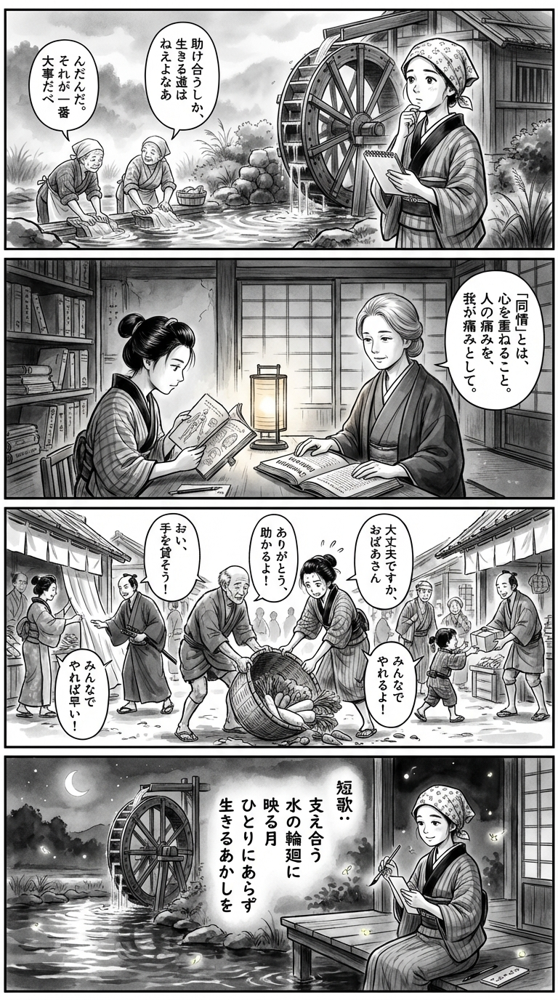

> **Language**: [日本語](../ja/水車小屋のネネ_review.html) | [English](../en/水車小屋のネネ_review.html) | [繁體中文](../zh-tw/水車小屋のネネ_review.html)
>
> [← Top / トップページ](../../)

# 書籍評論（繁體中文）

## 📖 書籍資訊
- **標題**: 水車小屋のネネ  
- **作者**: 津村 記久子  
- **ASIN**: B0CSYR76F8  
- **URL**: [https://www.amazon.co.jp/dp/B0CSYR76F8](https://www.amazon.co.jp/dp/B0CSYR76F8)  

---

## 對白

### Panel 1
**Scene**: 町娘站在江戶邊緣的吱吱作響的木水車旁，凝視著在晨霧中轉動的水車。她無意中聽到兩位洗衣婦談論「互相幫助是我們繼續前行的唯一方式」。女孩若有所思地歪著頭，感受到關於依賴與尊嚴的更深層真理。背景顯示一座安靜的水磨坊和流動的小溪，水面上泛起波紋的倒影。

### Panel 2
**Scene**: 在一個昏暗的寺廟圖書館裡，町娘正在閱讀一本破舊的蘭學手稿。對面坐著一位想像中的導師，形似作家津村菊子——一位面容平靜、智慧的女性，柔和的頭髮束起，穿著樸素的學者袍。她輕柔地指向一本關於「人類同情心」的荷蘭文書籍。場景散發著靜謐的同理心和知識的專注。

### Panel 3
**Scene**: 在熱鬧的江戶市場，女孩幫助一位年長的攤販撿起掉落的蔬菜籃。周圍的市民們自發地開始互相幫助，呼應著「善意的鏈條」。水車的圖案在他們身後微妙地再次出現，轉動得更快，彷彿被他們共同的善良所驅動。構圖充滿動感，展現出溫暖的人類表情。

### Panel 4
**Scene**: 傍晚時分，水磨坊旁。町娘坐在木甲板上，手握毛筆，正在小短冊上作詩。螢火蟲在她周圍漂浮，她輕輕微笑，凝視著轉動的水車——如今成為互助與重生的象徵。短詩內容如下：

**Tanka (translation)**:  
互相支撐  
水的輪迴中  
映照著月  
不再孤單  
活著的證明  

**Tanka (original)**:  
支え合う  
水の輪廻に  
映る月  
ひとりにあらず  
生きるあかしを

## 🎯 這本書的核心
《水車小屋のネネ》講述了在貧困和家庭崩潰中生活的姐妹，透過他人的善意和勞動逐漸實現自立的故事。主角理佐和律在互相幫助的過程中，體現了「自立並不等於孤立」的生命真理。  

故事通過她們與支持者之間的關係，描繪了善意如何連鎖並塑造人格。水車小屋和鸚鵡的ネネ等象徵性存在，靜靜地支撐著記憶和時間的流逝，講述著寬恕和重生的故事。  

津村記久子透過現實的勞動和生活描寫，鮮明地浮現出人類尊嚴和與他人共生的意義。  

---

## 💡 關鍵見解
- **自立是在互相支持中成立的**  
  理佐認為「獨立」並不是拒絕他人的援助，而是伴隨感謝和責任的選擇。自立被描繪成一種以人際關係為前提的成熟形態，而非孤立。  

- **善意的連鎖形成人格**  
  律說「我由他人的良心構成」，人是由他人行為的積累所塑造的。善意不是一時的行為，而是構成人格的基礎。  

- **貧困中也有智慧和自尊**  
  不以經濟困難為恥，誠實工作的態度支撐著尊嚴。津村將「貧窮」描繪成培養理解和共鳴的土壤，而非人類的弱點。  

- **工作即是生活本身**  
  勞動不僅是生計的手段，更是與世界的接觸，是確認自我存在的行為。理佐面對工作的姿態中，蘊含著生存的根本意志。  

- **從被支持者轉變為支持者**  
  律如同引導下一代，支持的連鎖跨越世代延續。人們在被他人幫助後，最終會變成幫助他人的存在。  

---

## 🔍 與現代背景的關聯
當今社會，個人化和孤立加劇，同時也需要重建互助和信任的時代。本作所描繪的「互助社群」，正是對這一時代需求的回應。  

正如三宅香帆所評，「在這個冷酷的時代，能夠誕生這樣的故事，值得慶賀」，這句話具有象徵意義。津村的筆觸讓人重新確認在當代不安和斷裂中，信任他人的美好。  

水車小屋作為社群的象徵，可以被解讀為在社交媒體和經濟差距所造成的現代分裂中，促進「共同生活」的重新定義的寓言裝置。  

---

## 🚀 實踐建議
1. **勇於接受幫助**  
   自立並不是拒絕他人，而是從互信開始。在困難時期，尋求支持是成熟的一步。  

2. **在日常中意識到小小的善意**  
   正如藤澤老師所言，對他人施以善意能豐富人生。小小的行為積累起來，能夠重建社會的信任。  

3. **將工作視為自我表達**  
   勞動不僅是生存的手段，更是確認自我價值的行為。誠實面對任何工作，能夠為人生建立軸心。  

4. **擁有記憶的場所**  
   像水車小屋一樣，擁有能夠回憶自己過去和人際連結的地方。那裡將成為心靈重生的據點。  

5. **將所受的支持傳遞下去**  
   意識到自己所受的善意應該回饋給他人。支持的連鎖將產生社會持續的希望。  

---

## ⭐ 總評
《水車小屋のネネ》是津村記久子作品中，特別深入探討「人與人之間關係的持續」的長篇小說。靜謐的筆觸描繪出姐妹與周圍人四十年的故事，重新思考在現代社會的分裂中「共同生活」的意義。  

讀者將感受到，只有在與他人的關係中才能獲得的溫暖和重生的力量。對於生活感到疲憊的人、感到孤立的人，以及渴望支持他人的所有人，這個故事將賦予他們靜默的勇氣。

---

&copy; shioki | [CC BY-NC-SA 4.0](https://creativecommons.org/licenses/by-nc-sa/4.0/)
