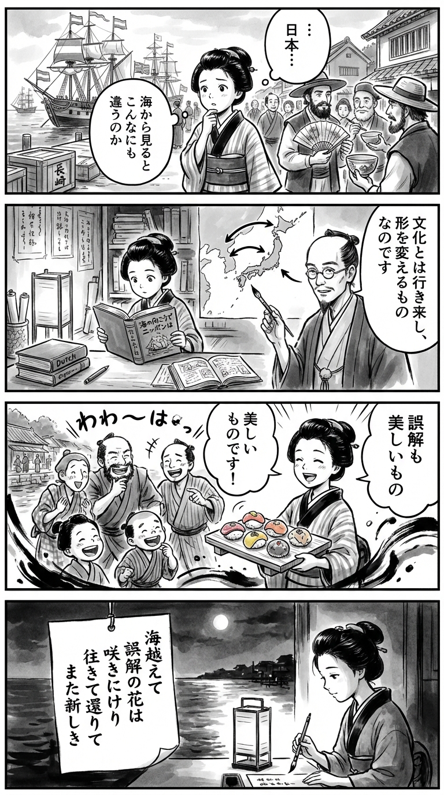

> **Language**: [日本語](../ja/海の向こうでニッポンは_review.html) | [English](../en/海の向こうでニッポンは_review.html) | [繁體中文](../zh-tw/海の向こうでニッポンは_review.html)
>
> [← Top / トップページ](../../)

# 書籍評論（繁體中文）

## 📖 書籍資訊
- **標題**: 海の向こうでニッポンは  
- **作者**: 井上 章一  
- **ASIN**: B0C5D9DGMR  
- **網址**: [https://www.amazon.co.jp/dp/B0C5D9DGMR](https://www.amazon.co.jp/dp/B0C5D9DGMR)  

---

<picture>
  <source srcset="../../images/reviews/海の向こうでニッポンは_4panel.webp" type="image/webp">
  
</picture>
## 🎯 本書的核心
《海の向こうでニッポンは》是一本探索日本文化在海外如何被接納、變遷，並再次回到日本的文化往還之書。作者井上章一跨越飲食、宗教、建築、藝術、流行文化等多樣領域，具體描繪「ニッポン」在世界中的形象。

本書的中心在於不否定「誤解」或「偏差」，而是將其視為新的文化創造契機的肯定視角。透過對海外日本文化的再詮釋及部分接受的案例，展示文化如何生存並持續變化。

井上還通過外部視角照亮日本人自身的文化自覺。換句話說，本書是試圖從外部的鏡子重新思考「日本文化是什麼」。

---

## 💡 關鍵洞見
- **文化是往還的存在**  
  日本文化並非單向輸出，而是具有循環運動的特性，經過海外的變遷再回到日本。照燒和杯麵的例子象徵著文化跨越國界重構的動態。

- **誤解孕育新文化**  
  異文化理解的偏差或誤讀，往往促進創造性文化的發展。會安的「日本橋」和稻荷壽司的再詮釋顯示，信息的不足反而激發想像力。

- **部分接受的力學**  
  在海外，日本文化並非整體被接受，而是醬油、豆腐、禪等特定元素單獨被接受的趨勢。文化的片段化接受暗示了全球化時代新文化流通的形式。

- **外部視角形成自我認識**  
  在德國的摔角界中日本摔角手的待遇等，外界的評價使日本人重新思考自己的文化定位。外部的目光成為重構內在日本形象的契機。

- **地方與普遍的共存**  
  京都和關西的文化、漫畫和動畫等地方表達，能引起全球的共鳴。地域性與普遍性的共存正是日本文化強韌魅力的源泉。

---

## 🔍 與現代文脈的關聯
在當代全球社會中，文化的「往還」和「誤讀」越來越成為日常現象。透過社交媒體和視頻平台，文化瞬間跨越國界，在當地文脈中被重新詮釋。井上所描繪的「創造性誤讀」正是這個時代文化交流本質的前瞻。

此外，日本文化的部分接受也與酷日本政策和次文化輸出的現狀相呼應。海外的受歡迎程度反過來改變國內的評價，這種「逆輸入」的結構是當代文化經濟的重要特徵。

本書的視角對於思考國際文化摩擦和身份的動搖也提供了豐富的啟示。相較於文化的純粹性，肯定混合與變化的姿態是未來文化理解所需的。

---

## 🚀 實踐建議
1. **不畏誤讀，創造性地接受**  
   不否定異文化間的誤解，並將其作為新表達或新想法的源泉。文化的偏差是創造的契機。

2. **斷片式發信自國文化**  
   像醬油和動畫這樣，切出具象徵性的元素進行發信，可以促進海外的接受。與其呈現整體，不如「強烈的片段」更能引起共鳴。

3. **以外部評價作為鏡子重新檢視自國**  
   觀察海外對日本文化的處理方式，可以重新發現自國文化的特性和挑戰。外部的視線是自我理解的輔助線。

4. **進行意識到文化往還的創作**  
   在創作作品或商品時，融入海外的反應和再詮釋。文化在走出國門後才會成熟。

5. **以地方文化為榮，進行普遍性敘述**  
   將地方文化以普遍的文脈進行敘述，可以獲得全球共鳴。地方性是國際魅力的源泉。

---

## ⭐ 總體評價
《海の向こうでニッポンは》是一本從根本上重新思考文化的知識冒險。井上章一的觀察力，透過海外對日本文化的奇妙變奏，生動地描繪出文化的生命力和柔韌性。

本書不僅對於從事國際文化交流的人士具有吸引力，也強烈呼喚希望重新發現自國文化的讀者。在全球化的時代，這是一本必讀書，旨在解放「日本性」的固定觀念，將其視為一個動態的存在。

---

&copy; shioki | [CC BY-NC-SA 4.0](https://creativecommons.org/licenses/by-nc-sa/4.0/)
