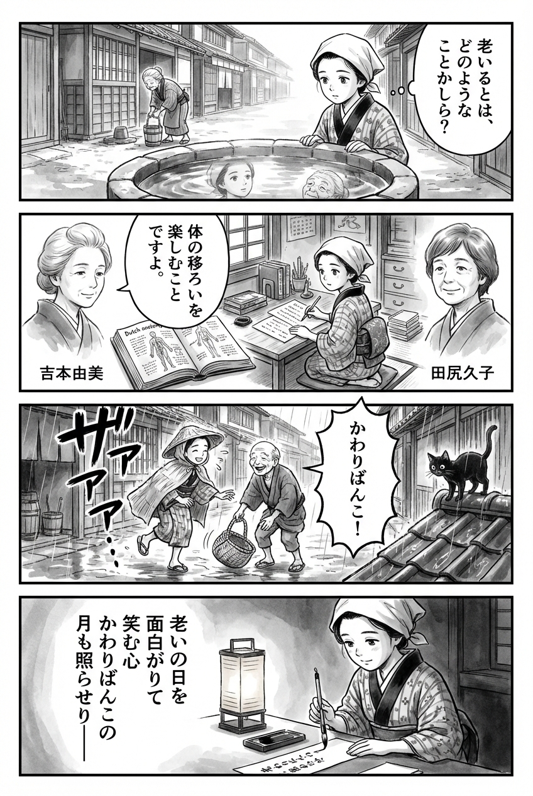

> **Language**: [日本語](../ja/熊本かわりばんこ_review.html) | [English](../en/熊本かわりばんこ_review.html) | [繁體中文](../zh-tw/熊本かわりばんこ_review.html)
>
> [← Top / トップページ](../../)

# 書籍評論（繁體中文）

## 📖 書籍資訊
- **標題**: 熊本かわりばんこ  
- **作者**: 吉本 由美 and 田尻 久子  
- **ASIN**: B0CT4VWWR9  
- **URL**: [https://www.amazon.co.jp/dp/B0CT4VWWR9](https://www.amazon.co.jp/dp/B0CT4VWWR9)  

---

<picture>
  <source srcset="../../images/reviews/熊本かわりばんこ_4panel.webp" type="image/webp">
  
</picture>

## 對白

### Panel 1
**Scene**: 在江戶的寧靜小巷中，町娘停在一口井邊，目睹一位老婦人努力提起水桶。她不禁自言自語：「變老是什麼意思？」晨光在水面上閃爍，映射出青春與年老的交錯瞬間。
**Dialogue**: 「變老是什麼意思？」

### Panel 2
**Scene**: 在她的小書房裡，町娘打開一本有關自然哲學的荷蘭書籍，旁邊是一封來自兩位智慧女性的手寫信 — 吉本由美和田尻久子的想像肖像在頁邊如幽靈般出現。吉本看起來平靜而深思，頭髮束成柔和的髻，眼神溫柔，似乎在看待生命的無常中找到幽默；田尻則顯得溫暖而踏實，短髮和穩定的目光，暗示著堅韌與關懷。她們似乎跨越時空，對她說：「在身體變化的四季中尋找快樂。」
**Dialogue**: 「在身體變化的四季中尋找快樂。」

### Panel 3
**Scene**: 町娘在一場突如其來的雨後走過小鎮。她在濕滑的石頭小路上稍微滑了一下，對自己笑了笑，然後幫助一位老先生撿起掉落的籃子。兩人一起笑著 — 他們的笑聲如同生命的「かわりばんこ」般回響。一隻貓在屋頂的瓦片上靜靜地觀察著他們。整體構圖動感十足，雨水用濃墨的水墨畫筆觸描繪。
**Dialogue**: （無）

### Panel 4
**Scene**: 那個晚上，她坐在紙燈籠旁，手握毛筆，在一條狹窄的紙上寫著和歌。墨水柔和地滲透進紙纖維中，隨著她的書寫：
**Tanka (translation)**: 在老去的日子裡，心中充滿了趣味與微笑，月光也照耀著生命的變遷。
**Tanka (original)**: 「老いの日を  
　面白がりて  
　笑む心  
　かわりばんこの  
　月も照らせり」

## 🎯 本書的核心
《熊本かわりばんこ》是兩位女性在熊本這片土地上透過往復書簡交談，重新發現人生「第二章」的記錄。從東京回到熊本的作者，靜靜描繪她在自然、社區和人際關係中培養「享受老去」的心態的過程。

本書的核心在於不懼怕老去，反而將其視為一種新的感受，重新輕鬆地生活。透過與自然、文化和社區的關係，書中闡述了在面對失落和孤獨的同時，如何創造「愉快的老後」的智慧。

---

## 💡 關鍵洞見
- **「享受老去」的視角力量**  
  將衰老帶來的不便視為發現，而非悲觀，讓日常生活重新煥發活力。視角的轉變是幸福感的源泉，貫穿全書。

- **與自然共生使心靈平靜**  
  透過觀察街道樹、庭院和湧水等自然現象，擺脫以人為中心的價值觀。察覺自然的「看不見的恩惠」，是恢復心靈富足的關鍵。

- **社區互助帶來的安全感**  
  書中描繪了熊本地震和疫情後，鄰里之間的聯繫成為生活的力量。防止孤立，重新確認共同生活的意義。

- **透過失落深刻感受存在**  
  將失去的存在視為在記憶中持續生活的事物，而非悲傷。勇於面對失落，發掘其中的「存在之力」的態度令人印象深刻。

- **文化成為生活的養分**  
  閱讀、電影、音樂等文化活動豐富了老去的時光。知識與感性活動被描繪為心靈恢復和創造的源泉。

---

## 🔍 與現代背景的關聯
本書所描繪的「かわりばんこ」精神，與當代日本推動的社區共生型社會理念深刻共鳴。在少子高齡化和核心家庭化的背景下，社區互助的機制愈發重要，而以熊本為舞台的本作，正是提供了這種實踐的心態。

此外，在SDGs目標中提到的「可持續社區建設」方面，本書的思想也具有啟發性。與自然共生、跨世代的互助，以及「將個人的幸福擴展至社區的幸福」的感覺，都是未來社會不可或缺的視角。

---

## 🚀 實踐建議
1. **觀察老去的變化，並將其轉化為笑聲**  
   以幽默的方式看待衰老帶來的不便，能夠產生心靈的寬裕。透過日記或照片記錄「老去的發現」，成為自我接納的第一步。

2. **有意識地建立與社區的關係**  
   通過習慣性地向鄰居打招呼和進行小對話，培養在非常時期也能互相支持的關係。人際聯繫是老後安心的基礎。

3. **擁有與自然接觸的時間**  
   透過打理庭院或散步等方式，與自然互動使心靈得到平靜。自然是療癒衰老的最佳夥伴，帶來日常的小確幸。

4. **肯定「無所事事的時間」**  
   無需罪惡感地度過無為的時間，使身心恢復，激發創造性思維。休息也是一種有意識的生活方式。

5. **將文化活動融入生活**  
   透過閱讀、觀影、音樂等方式，擁有刺激感性的時間。文化是支撐老去的「心靈養分」，為人生增添色彩。

---

## ⭐ 總體評價
《熊本かわりばんこ》是一本描繪如何不懼怕老去，反而愉快生活的智慧，與熊本這片土地相伴的靜謐人生書。書中沒有華麗的事件或戲劇性的展開，但日常生活中的小幸福和人情溫暖，卻能溫暖讀者的心靈。

這本書適合那些希望以積極的態度看待老去的人、想重新思考地方生活的人，以及所有希望靜靜思考「生活是什麼」的讀者。閱讀本書能讓人稍微放慢人生的速度，重新發現當下時間的珍貴。

---

&copy; shioki | [CC BY-NC-SA 4.0](https://creativecommons.org/licenses/by-nc-sa/4.0/)
