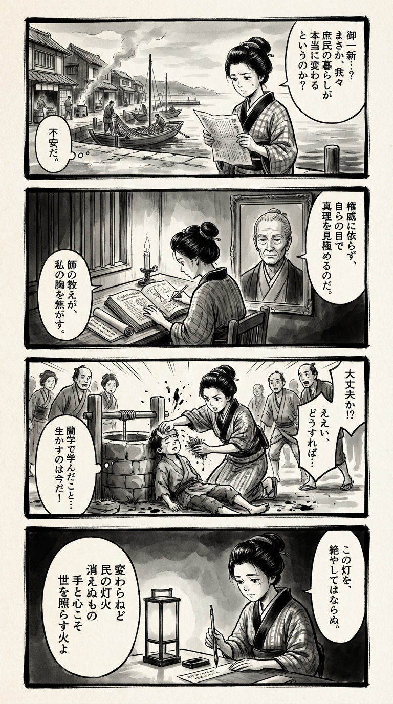

> **Language**: [日本語](../ja/狗賓童子の島_review.html) | [English](../en/狗賓童子の島_review.html) | [繁體中文](../zh-tw/狗賓童子の島_review.html)
>
> [← Top / トップページ](../../)

# 書籍評論（Markdown・繁體中文）

## 📖 書籍資訊
- **標題**: 狗賓童子の島  
- **作者**: 飯嶋和一  
- **ASIN**: B07X6T663D  
- **URL**: [https://www.amazon.co.jp/dp/B07X6T663D](https://www.amazon.co.jp/dp/B07X6T663D)  

---

<picture>
  <source srcset="../../images/reviews/狗賓童子の島_4panel.webp" type="image/webp">
  
</picture>

## 對白

### Panel 1
**Scene**: 町娘在江戶寧靜的港口漫步，手中閱讀著有關「御一新」（明治維新）的報紙，低聲自語著：「平民的生活真的會改變嗎？」背景中可以看到木製的排屋、漁夫在修補漁網，以及從廚房冒出的煙霧，營造出一種靜謐而堅韌的氛圍。
**Dialogue**: 「平民的生活真的會改變嗎？」

### Panel 2
**Scene**: 在一間小書房裡，燭光照亮了町娘正在專心研究的荷蘭醫學書籍和地方治理的卷軸。牆上掛著一幅老學者的肖像，似乎是作者飯嶋和一——想像中是一位思考深邃的老人，眼神和藹卻又銳利，灰白的頭髮整齊地束起，氣質冷靜而嚴謹，身著簡單的長袍。他的精神似乎在守護著她，仿佛在催促她尋求超越權威的真理。

### Panel 3
**Scene**: 在村莊的水井旁，一個生病的孩子突然倒下。町娘跪下來幫助，回想起她從荷蘭醫學書中學到的知識。她即興用草藥製作了敷料，認真地敷在孩子的身上，村民們在旁觀望。她的袖子捲起，神情專注——知識轉化為行動。構圖動感十足，墨水飛濺暗示著緊迫感和道德覺醒。

### Panel 4
**Scene**: 夜幕降臨，町娘坐在燈籠旁，手握毛筆，正在狹窄的短冊上作詩。紙張在黑暗中柔和地發光，她的眼中流露出悲傷與靜謐的力量。短詩內容如下：
**Tanka (translation)**: 雖然不會改變，  
人民的燈火，  
永不熄滅，  
雙手與心靈，  
才是照亮世界的火焰。  
**Tanka (original)**: 変わらねど  
民の灯火  
消えぬもの  
手と心こそ  
世を照らす火よ

## 🎯 這本書的核心
《狗賓童子の島》是一部描繪幕末維新這一動盪時代的歷史文學，並非從中央的視角，而是從隱岐這個邊緣地帶出發。飯嶋和一透過民眾自力更生、抵抗統治結構的姿態，提出了「民的尊嚴」與「自立的力量」這兩大主題。

本書的核心在於對權力腐敗及其延續性的冷靜洞察。即使從幕府轉向新政府，民眾仍然被迫承擔犧牲的結構並未改變。飯嶋以行動而非理念的方式，描繪了那些活在現實中的人們。

此外，透過醫術、農業及與自然共生等「知識與技術的實踐」，探討人們如何實現自立。雖然意識到無常，書中人物仍然堅持履行自己的責任，這種姿態促使讀者深思並產生強烈的覺悟。

---

## 💡 關鍵見解
- **「御一新」的虛偽與民眾的現實**  
　維新的「御一新」並非民眾的解放，而是舊體制延續的虛偽。這種對支配結構本質不變的觀點，為重新思考歷史提供了契機，讓我們從民眾的視角出發。

- **知識只有透過實踐才有意義**  
　常太郎的醫術修行象徵著知識並非書本上的理論，而是透過行動才能真正拯救人。只有透過經驗的累積，才能獲得真正的理解，這對現代社會也具有啟示意義。

- **民的自治與自立的可能性**  
　隱岐島民的自治嘗試顯示了即使沒有中央的統治，仍然可以保持秩序。這證明了民眾的底力，能夠斷絕對權威的依賴，依靠共同體的力量生活。

- **與自然共生的生活倫理**  
　抵抗貨幣經濟，依賴自然的恩賜生活的人物，對現代的拜金主義發出警鐘。自然的和諧被描繪為支撐人類生命的根本力量。

- **行動中的正義，而非理念**  
　「理念無法替代食物」這句話象徵著，真正的正義在於在現實中以行動來促進他人，而非抽象的理想。實踐倫理的艱難與尊貴在此浮現。

---

## 🔍 與現代脈絡的關聯
在當代日本，中央集權的政治結構及經濟差距的擴大，重新質疑地方及個人的自立。《狗賓童子の島》所描繪的「民的自治」與「與自然共生的生活」，提供了這個時代另一種生存的模式。

此外，在全球化與資訊化的背景下，知識與實踐脫節，理念空洞化的現代，本書「知識只有透過行動才有意義」的主張，顯得格外尖銳。在由AI與效率主導的社會中，重新確認人類「手」與「心」所根植的知識價值。

更進一步，在環境危機與孤立化加劇的現代社會中，與自然共生及重建共同體的主題，不僅是懷舊，更是未來的指引。飯嶋的筆觸在描繪過去的同時，質疑現代的倫理與生存方式。

---

## 🚀 實踐建議
1. **選擇行動而非理念**  
　不僅僅是高舉理想，還要採取行動幫助眼前的人。根植於現實的小實踐，將成為改變社會的第一步。

2. **在現場驗證知識**  
　將所學應用於實際中，勇於面對失敗並積累經驗。正如常太郎所示，只有透過實踐才能獲得真正的理解。

3. **意識到與自然共生**  
　在日常生活中恢復自然的節奏。自給自足的創意及利用當地資源，將成為對抗拜金主義的力量。

4. **不依賴權威，自主判斷**  
　不盲目遵從社會或組織的指示，根據自己的價值觀與經驗做出決策。將自治精神融入個人的生活方式，便是通往自立的道路。

5. **接受無常，活在當下**  
　意識到人生的有限性，毫不拖延地全力以赴地做當下能做的事。對無常的覺知將成為行動的動力。

---

## ⭐ 總體評價
《狗賓童子の島》是一部從歷史邊緣描繪人類尊嚴與自立的厚重且普遍的史詩。飯嶋和一的筆觸超越了史實的再現，浮現出民眾生活的真實性與倫理的強度。

這部作品挖掘了被中央故事掩蓋的「未被訴說的歷史」，重新思考現代社會中自立與共生的意義。本書描繪了以行動而非理念生活的尊貴，將為身處變革時代的所有讀者帶來靜謐的覺悟與希望。

---

&copy; shioki | [CC BY-NC-SA 4.0](https://creativecommons.org/licenses/by-nc-sa/4.0/)
