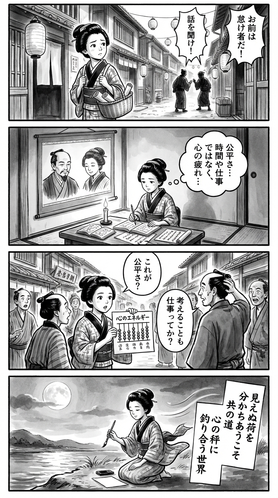

> **Language**: [日本語](../ja/発達系女子とモラハラ男_review.html) | [English](../en/発達系女子とモラハラ男_review.html) | [繁體中文](../zh-tw/発達系女子とモラハラ男_review.html)
>
> [← Top / トップページ](../../)

# 書籍評論（繁體中文）

## 📖 書籍資訊
- **標題**: 發達系女子與莫拉哈拉男  
- **作者**: 鈴木大介 and いのうえさきこ  
- **ASIN**: B08ZY7B51N  
- **URL**: [https://www.amazon.co.jp/dp/B08ZY7B51N](https://www.amazon.co.jp/dp/B08ZY7B51N)  

---

<picture>
  <source srcset="../../images/reviews/発達系女子とモラハラ男_4panel.webp" type="image/webp">
  
</picture>
## 🎯 本書的核心
《發達系女子與莫拉哈拉男》是一本試圖透過擁有發展障礙或高次腦功能障礙的女性及其伴侶之間的關係，重新定義「理解」與「公平」的書籍。作者鈴木大介因自身的中途障礙，獲得了從「當事者的感受」重新審視世界的不合理性，並細緻描繪了擁有發展特性的個體在日常生活中所面臨的困難。

本書的核心在於在家庭這一最小單位的共同體中，彼此翻譯特性，追求認知負擔的公平。這是一種超越單純「支持」或「理解」，重新設計共同生活結構的思想挑戰。

---

## 💡 關鍵洞見
- **「公平」是腦部消耗量的平衡**  
　將家務和生活負擔不再以時間或工作量衡量，而是以認知能量的消耗來評估，提出了共生社會中新平等的形式。這也是一種為了可視化看不見的努力和疲勞的倫理視角。

- **「聽流癖」並非懶惰而是特性**  
　理解注意障礙和工作記憶問題，可以斷絕誤解和憤怒的連鎖。理解行為背後的神經特性，成為真正共感的起點。

- **自我照顧無法單靠個人培養**  
　不將自我管理視為「個人的責任」，而是透過相互觀察和支持來培養，重新定義伴侶關係為「共同教育」的場域。

- **擺脫「生產力的詛咒」**  
　批判以生產力衡量社會價值的風潮，尊重「成為某人的伴侶」這一事實，實現了對人類存在的肯定思想轉變。

- **家庭是障礙化與再生的場所**  
　家庭既能因誤解和支配而產生痛苦，也能因理解和調整而成為恢復的場所。本書提供了一種將家庭視為社會變革起點的視角。

---

## 🔍 與現代文脈的關聯
在現代日本，家庭和職場中的道德騷擾日益增加，壓力社會和能力主義被認為是其背景。特別是男性的「居高臨下的溝通」和支配態度，被視為性別不平等的象徵。

本書可視化了在這樣的社會結構中，擁有發展特性的女性如何承受「未被理解的痛苦」。作者提出的「翻譯」和「認知資源的公平」，不僅超越家庭內的調整，還成為提高整個社會包容性的實踐模型。在當前需要性別再教育和共感對話的時代，本書提供了思想基礎。

---

## 🚀 實踐建議
1. **重新檢視家務和負擔的「腦部消耗量」**  
　以精神和認知負擔為基準重新設計分擔，實現無壓力的共生。

2. **將口頭指示轉化為「不會消失的信息」**  
　透過備忘錄或聊天等視覺化的方式共享信息，以補償工作記憶的不足，避免誤解。

3. **將對話視為「翻譯工作」**  
　整理對方的發言，補充意義的姿態，有助於與非典型發展者的對話順暢。

4. **互相觀察彼此的身體狀況和情緒**  
　養成注意日常小變化並主動關心的習慣，自然培養自我照顧的意識。

5. **擺脫「角色的詛咒」**  
　放下社會生產力的價值觀，肯定存在本身，緩解關係緊張，建立安心的家庭。

---

## ⭐ 總體評價
本書描繪了與發展障礙伴侶的共生，敏銳地切入現代社會的「理解不足」和「公平感缺失」，是一部實踐性的思想書。透過家庭這一微觀場域，照射出社會結構性問題的筆觸，實現了社會學洞察與人性理解的雙重平衡。

對於關心發展障礙和道德騷擾問題的讀者，以及在伴侶關係中感到困惑的所有人，本書都是鍛鍊理解他人的想像力的一本好書。讀後將重新思考「共同生活」的意義。

---

&copy; shioki | [CC BY-NC-SA 4.0](https://creativecommons.org/licenses/by-nc-sa/4.0/)
