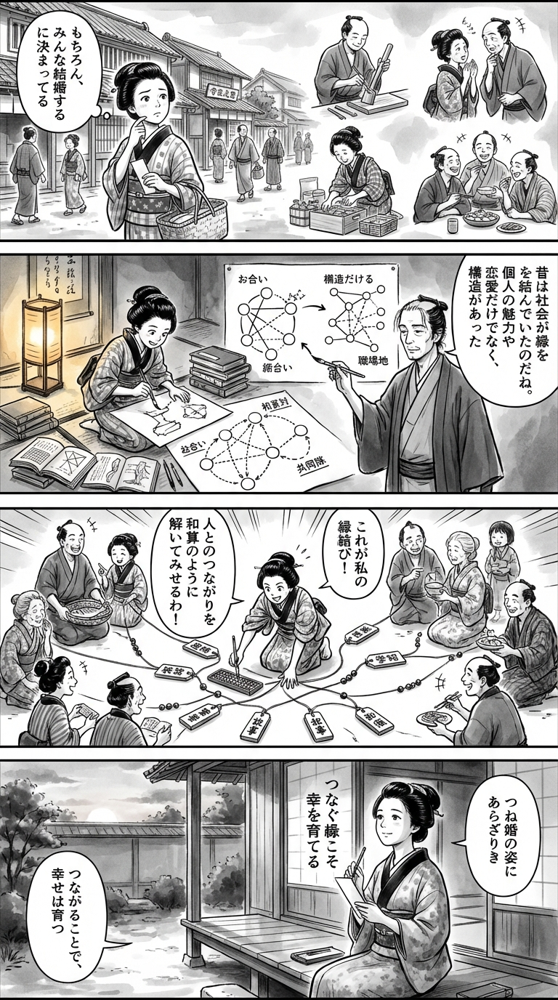

---
---
> **Language**: [日本語](../ja/結婚滅亡～「オワ婚時代」のしあわせのカタチ～_review.html) | [English](../en/結婚滅亡～「オワ婚時代」のしあわせのカタチ～_review.html) | [繁體中文](../zh-tw/結婚滅亡～「オワ婚時代」のしあわせのカタチ～_review.html)
>
> [← Top / トップページ](../../)

## 對白

### Panel 1
**Scene**: 在熱鬧的江戶街景中，長屋與寺子屋相鄰，町娘提著小籃子與摺好的短冊，聽見路人隨口說「人人都該結婚」。她神情若有所思，略帶懷疑。畫面中可見不同生活方式的人們：快樂的單身職人、愛八卦的夫妻、忙碌的寡婦、一起分食的朋友們。整體氣氛提出疑問——婚姻真的是唯一自然的道路嗎？她的表情好奇、敏銳，帶著一絲靜靜的反骨。  
**Dialogue**: （無台詞，內心思索的氣氛）

### Panel 2
**Scene**: 在紙燈籠照亮的雜亂書齋一角，町娘專注閱讀和算書與蘭學書籍，畫著連結圈與斷橋的社會結構圖，而非戀愛符號。她領悟到婚姻多半依靠社會制度與媒合網絡，而不只是個人魅力或愛情。旁邊出現一位想像中的蘭學導師——中年男子，髮稍長束於後，無眼鏡，神情沉穩，身著素樸的學者羽織，正指著顯示「相親網絡與社群聯繫逐漸消失」的圖表。整體氛圍是理性發現與結構洞察，而非浪漫情懷。  
**Dialogue**: （導師輕聲指導，町娘專注聆聽）

### Panel 3
**Scene**: 從高角度俯瞰，町娘在巷弄中熱情地製作「江戶人際連結圖」，用算盤珠、繩線與木牌連結鄰人——依興趣、學習會、互助、共餐、詩歌與買賣，而非僅限婚配。人們驚訝地圍觀：魚販加入讀書會、老婦提供育兒幫忙、職人邀人共餐、獨食者露出笑容。整個網絡如活的社群般擴展。笑點在於她把人際關係當作和算幾何與蘭學圖解般處理，證明幸福能透過多重靈活的連結而生，不必依附於配偶。她神情自信而愉悅。  
**Dialogue**: 「看吧！這樣大家都能連在一起！」

### Panel 4
**Scene**: 黃昏時分，町娘坐在木製緣側或紙窗旁，手執毛筆，在短冊上寫下和歌。她神情平靜而滿足，墨色漸淡，留白中帶著淡淡的物哀之感。  
**Dialogue**: （輕聲吟誦短歌）  
**Tanka (translation)**: 「婚姻並非人人的常態；真正滋養幸福的，是彼此相連的緣分。」  
**Tanka (original)**:  
「みな婚は  
つねの姿に  
あらざりき  
つなぐ縁こそ  
幸を育てる」

## 📖 書籍資訊
- **書名**: 結婚滅亡～「オワ婚時代」のしあわせのカタチ～
- **作者**: 荒川和久
- **ASIN**: [B0819T81NC](https://www.amazon.co.jp/dp/B0819T81NC)
- **URL**: [https://www.amazon.co.jp/dp/B0819T81NC](https://www.amazon.co.jp/dp/B0819T81NC)

## 🎯 本書的核心
本書最大的特色在於，它從歷史與制度的角度，重新審視日本「理所當然會結婚」的常識。作者將「皆婚社會」視為一個特殊時代的產物，而非人類的自然狀態，指出那是透過國家政策、相親制度與職場婚姻等社會安排所形成的結果。

在此基礎上，作者否定了將未婚化歸咎於年輕人價值觀或戀愛冷感的簡化論點，主張真正的問題在於支撐婚姻的「媒合結構」崩壞。換言之，本書提供了一個新的視角，讓讀者將結婚問題理解為社會制度變化的結果，而非個人努力或魅力不足。

進入後半部分，作者不僅止於悲觀地談論婚姻衰退，而是探討在「單身化」與「非婚化」的時代，如何重新設計幸福。避免對家庭或配偶的唯一依賴，並在「連結型社群」中建立關係，這樣的提案使本書超越單純的社會批評，展現出積極的未來視野。

## 💡 關鍵洞見
- **皆婚社會並非普遍現象，而是極為例外的時代**  
  本書指出，戰後日本的高婚姻率並非人類本能的自然結果，而是政策、習俗與制度共同推動的結果。這讓「以前大家都會結婚，現在的年輕人卻不懂」這類道德批判，顯得在歷史認識上站不住腳。

- **未婚化的本質不在於價值觀改變，而在於婚姻機會結構的消失**  
  作者指出，相親與職場婚姻的減少與婚姻數下降的趨勢重疊，這是書中最具說服力的觀點之一。將婚姻減少視為社會「媒合功能」的縮小，而非戀愛能力或意識的問題，讓討論焦點從個人責備轉向制度設計。

- **戀愛與結婚是兩回事，戀愛強者不一定是婚姻強者**  
  本書將結婚視為一種現實的社會制度，而非浪漫愛情的延伸。這樣的觀點迫使讀者重新思考婚活與伴侶關係，不再將其視為個人能力競爭的場域。

- **單身化不是缺陷，而是社會的新常態**  
  對於將「一個人生活」視為寂寞替代行為的觀點，作者提出明確反駁。透過將「單身活動」與消費、都市空間變化連結，本書讓非婚與單身生活被重新理解為生活方式的再編，而非失敗的象徵。

- **幸福不是結婚的狀態，而是在多重連結中孕育**  
  作者一再強調，幸福並不內含於「已婚」這個狀態中。真正重要的是擁有不侷限於家庭的多重關係，並在這些連結中共享與共度時光。這正是本書最終的訊息所在。

## 🔍 與現代脈絡的關聯
本書的論點與日本當前的少子化、未婚化、雙薪化與女性就業擴大等社會變化緊密呼應。尤其在以婚姻為前提的生活設計逐漸失效，而社會制度與意識尚未跟上的現實下，本書的結構分析依然極具啟發性。

此外，婚活市場的條件不匹配、地方人口外流、育兒成本上升等問題，使得婚姻困境難以僅靠個人意志解決。在這樣的背景下，本書不僅探討「是否結婚」，更進一步思考「在婚後社會中如何生活」，展現出強烈的現代意識。

再者，隨著單身人口增加與「單身消費」普及，本書提出的「連結型社群」概念將愈發重要。相較於固定歸屬，擁有多重、鬆散的連結能提供安全感與歸屬感，這種觀點自然延伸至家庭觀、都市生活與工作方式的變化。

## 🚀 實踐建議
- **有意識地增加家庭以外的連結**  
  無論是朋友、興趣夥伴、學習社群或鄰里關係，建立可依靠的多重連結對未婚者與已婚者都同樣重要。正如本書指出，只有單一支援窗口的狀態非常脆弱，擁有多重關係能有效預防孤立。

- **以「連結」而非「隸屬」的心態參與社群**  
  不必每次都深入參與，可從讀書會、單次活動、歡迎單人參加的聚餐等輕鬆的接觸開始。即使容易被緊密人際關係耗盡的人，也能以此方式維持與社會的連結。

- **暫時放下「結婚就會幸福」的前提**  
  試著寫下自己在哪種關係中感到安心、與誰相處時最充實，能更清楚看見真正的需求。若將結婚本身視為目的，反而可能做出不適合自己的選擇，因此這樣的整理極具實用性。

- **不必為「一人時光」感到罪惡，將其作為提升生活品質的資源**  
  一個人吃飯、出遊、學習、享樂等行為，應被視為主動選擇，而非孤單的補償。若能建立「需要時連結他人」的節奏，就能避免混淆孤立與自立。

- **將閱讀與感受語言化，並與他人交流**  
  如同本書所建議，寫下思考是讓價值觀具象化的過程。進一步與他人分享感想，能引入新的觀點，幫助更新對幸福與婚姻的既有想法。

## ⭐ 總體評價
《結婚滅亡》對於厭倦了通俗婚姻論戰的人來說，是一本讓思考重新流通的作品。它既非歌頌婚姻，也非反婚宣言，而是從歷史、制度與社會結構的角度，細緻地重構「為何結婚變得困難」與「不結婚是否不幸」這兩個問題，提供理性思考的基礎。

對未婚者而言，它有助於擺脫「自我責任論」的壓力；對已婚者而言，則是重新檢視家庭依附風險的契機。無論是想結婚、不想結婚，或已婚之人，都能從不同角度受到啟發。讀完之後，讀者將會想重新從「關係」而非「制度」的角度，思考「幸福是什麼」。

---

&copy; shioki | [CC BY-NC-SA 4.0](https://creativecommons.org/licenses/by-nc-sa/4.0/)
