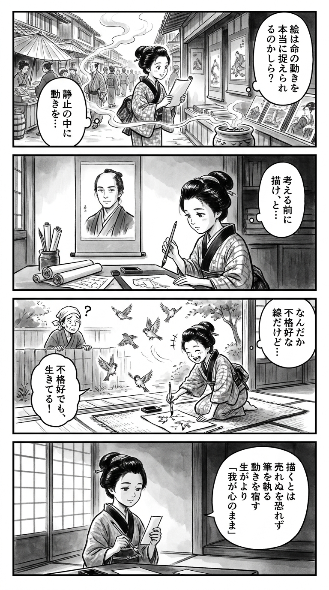

> **Language**: [日本語](../ja/練馬純情伝_review.html) | [English](../en/練馬純情伝_review.html) | [繁體中文](../zh-tw/練馬純情伝_review.html)
>
> [← Top / トップページ](../../)

# 書籍評論（Markdown・繁體中文）

## 📖 書籍資訊
- **標題**: 練馬純情傳  
- **作者**: 吉森大祐  
- **ASIN**: B0GX17JG7V  
- **URL**: [https://www.amazon.co.jp/dp/B0GX17JG7V](https://www.amazon.co.jp/dp/B0GX17JG7V)  

---

<picture>
  <source srcset="../../images/reviews/練馬純情伝_4panel.webp" type="image/webp">
  
</picture>

## 對白

### Panel 1
**Scene**: 町娘在繁忙的江戶市場中漫步，四周是擺滿紙張和印刷品的小攤。她停在一間展示手繪畫卷的商店前，低聲自語：「藝術真的能捕捉生命的運動嗎？」她的眼中閃爍著好奇，隨著爐火冒出的煙霧在空中如墨線般盤旋，呼應著「靜中捕捉動感」的主題。

### Panel 2
**Scene**: 在一間昏暗的書房裡，町娘專心研究卷軸和荷蘭的圖表。書桌上方懸掛著一幅沉思的男子肖像，想像中的作者吉守大輔，眼神平靜，頭髮束起，學者的氣質。似乎他的目光在指引著她，當她研究筆觸和構圖時，耳邊輕聲傳來無形的教誨：「先畫，後思。」

### Panel 3
**Scene**: 她跪在庭院中，手握毛筆，描繪四處飛散的麻雀。她的筆觸狂野卻充滿生命。一位鄰居探頭過來，對她「凌亂」的線條感到困惑，但她畫中的小鳥似乎要從頁面上翱翔而出——她笑了，意識到創作源於不完美和堅持。

### Panel 4
**Scene**: 黃昏的光線透過紙屏風。町娘坐在矮桌前，正在小的短冊上寫作一首和歌，反映出書的精髓。她的表情平靜而堅定，寫下：

「描くとは  
　売れぬを恐れず  
　筆を執る  
　動きを宿す  
　我が心のまま」

**Tanka (translation)**: 創作是無畏於不被銷售，握住筆，讓心中的動感流露而出。
**Tanka (original)**: 「描くとは  
　売れぬを恐れず  
　筆を執る  
　動きを宿す  
　我が心のまま」

## 🎯 這本書的核心
《練馬純情傳》以昭和40年代的練馬為背景，描繪了一群將漫畫這一新藝術視為一切的年輕人的青春故事。透過他們在貧困與夢想、理想與現實之間的掙扎，浮現出「創作是什麼」「生活是什麼」這些根本性的問題。

本作的核心在於將創作視為一種崇高的行為，而非單純的勞動或職業。拒絕效率與商業性，追求純粹表達的年輕漫畫家們的身影，與戰後日本文化的蓬勃發展交織在一起，讓人重新確認藝術的根源。

此外，女性漫畫家的崛起以及對新表達的挑戰，生動地描繪了漫畫這一媒介如何接納多元價值觀並不斷變化。

---

## 💡 關鍵見解
- **「用影像看世界」的創作視角**  
　漫畫家必須具備在靜止畫面中感受到動態的能力，這一教誨觸及了表達者的本質。用「動作」來捕捉世界的視角，是為創作注入生命的第一步。

- **從輸出開始的創作哲學**  
　比起累積知識，首先動手創作才是創作的起點，這一思想對現代創作者也有共鳴。超越完美主義，在實踐中找到自己的表達姿態至關重要。

- **「不賣」與「沒有價值」的區別**  
　不受商業成功影響，持續發表作品本身就是一種尊貴的行為，這一信息對所有志於創作的人都是鼓勵。持續性比評價更能塑造真正的創造者。

- **嫉妒與成長的循環**  
　經歷無法祝賀同伴成功的痛苦，面對自己的表達，ミチオ的形象象徵著創作的成熟過程。將情感的波動轉化為養分，成為創造的源泉。

- **女性作家的表達革新**  
　牧村美弥子和生田リヨ子的挑戰，將少女漫畫從幻想的世界推向現實與知性的表達。女性的視角開創了新的藝術地平。

---

## 🔍 與現代文脈的關聯
本作所描繪的「創作與商業的掙扎」，與當前的創作者經濟息息相關。在社交媒體和數位發行的時代，堅持「自我表達」的難度並未改變，昭和時期漫畫家的奮鬥是現代藝術家面臨的課題原型。

此外，女性作家的崛起主題與當前的性別平等和多樣性討論相呼應。像牧村和生田這樣，以自身的感性開拓新表達的姿態，與當今女性創作者的態度相重疊。

以戰後自由與夢想的時代為背景的本作，是重新思考創作根源的鏡子，並向生活在變革時代的我們提出「創作的意義」的質疑。

---

## 🚀 實踐建議
1. **從動手開始**  
　在構思完美之前，先畫出線條，將其具體化，這是創作的第一步。實踐引導思考。

2. **尋求可靠的批評**  
　在創作初期，接受專業的批評比情感性的意見更能促進成長。正確的批評將支持下一次創作。

3. **將他人的成功轉化為激勵**  
　不否定嫉妒與焦慮，而是將其轉化為創作的動力。重要的是要擁有磨練自我表達的視角，而非比較。

4. **區分商業與藝術**  
　不因市場評價而喜怒無常，堅持持續發表自己的作品。持續性是創作信念的證明。

5. **不畏時代變化，探索新表達**  
　超越既有框架，相信自己的感性並勇於挑戰，這將孕育出新時代的創造者。

---

## ⭐ 總體評價
《練馬純情傳》是一部正面描繪創作中人們的驕傲與苦惱的青春文學作品。透過昭和漫畫家的身影，質疑藝術是什麼，表達應該如何存在。

本作是對所有創作者、藝術家以及任何「想要創造」的人，提醒他們回想創作的根源。當迷惘於創作時，這個故事將再次賦予我們動手的勇氣。

---

&copy; shioki | [CC BY-NC-SA 4.0](https://creativecommons.org/licenses/by-nc-sa/4.0/)
