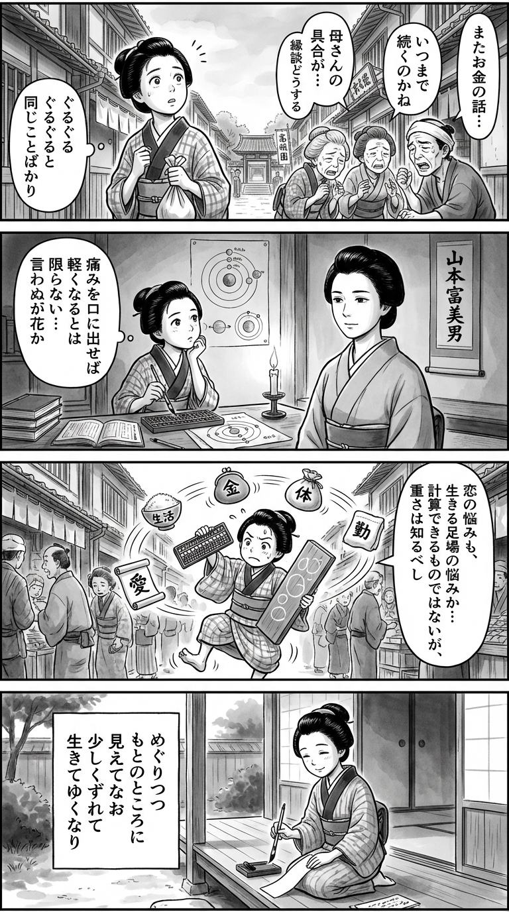

---
---
> **Language**: [日本語](../ja/自転しながら公転する_review.html) | [English](../en/自転しながら公転する_review.html) | [繁體中文](../zh-tw/自転しながら公転する_review.html)
>
> [← Top / トップページ](../../)

## 對白

### Panel 1
**Scene**: 在江戶狹窄的小巷中，兩旁是長屋、晾衣繩，遠處可見一間小寺子屋。町家少女一邊提著日常採買之物，一邊停下腳步，無意間聽見鄰里反覆繞著家中煩惱、婚事憂心、錢財困境，以及母親說不清的身體痛苦打轉。眾人你一言我一語，話語卻始終兜圈，勸告不斷，事情依然無解。她抬頭望向天空，神情驚訝又若有所思，彷彿察覺人生會同時把人拉向四面八方，像是在前進，也像停在原地。請強調尋常生活中的情緒張力、大人們臉上淡淡的疲憊，以及少女逐漸甦醒的好奇心。  
**Dialogue**: 可加入鄰人的隻言片語，如：「總會有辦法吧……」「婚事也不能再拖了。」「明明一直在想辦法，卻還是沒有用。」「這身子的不舒服，連自己也說不清。」

### Panel 2
**Scene**: 在燭光搖曳的室內，四周擺滿和算書、算盤與蘭學書籍。町家少女對照圓形、旋轉與軌道的圖示思索人生，逐漸明白：並不是所有痛苦在說出口、被命名後就會變輕；也不是所有真相都適合直截了當地說破。畫面中加入一位帶有導師氣息、如文學幽影般的女性形象，作為想像中的存在：日本女子，氣質平靜、內省，溫和卻堅定，穿著樸素素色和服，深色頭髮簡單束起，不戴眼鏡，體態中等，神情嚴肅卻帶憐憫。她可以像是掛軸肖像悄然活了過來，也可以像是坐在一旁、以洞悉目光靜靜注視的書肆女學者。整體氣氛應沉思、聰慧，並帶著安靜的嚴峻感。  
**Dialogue**: 可加入少女心聲，如：「原來，不是說出來就會變輕……」「有些事，就算明白，也未必能直說。」

### Panel 3
**Scene**: 以大膽、有動感、略帶幽默的構圖呈現：在熱鬧的市街上，町家少女拿著算盤與像黑板般的木板，試圖把「煩惱」本身也算清楚——一顆珠子代表愛情，一顆代表工作，一顆代表家中責任，一顆代表身體，一顆代表金錢。她的頭頂四周，這些憂慮化為巨大的旋轉天體與日常器物繞行：飯碗、錢袋、書信、藥袋、縫紉布料，全都像行星般盤旋。她一度站立不穩，差點失去平衡，卻最終仍穩穩踩住腳步。笑點在於：她無法讓這些球體消失，只能學著理解它們的重量與運行節奏。此格要戲劇化地呈現一個體悟——對愛情的焦慮，其實也是對自己如何在世間站穩腳跟的焦慮。  
**Dialogue**: 可加入少女自語，如：「愛情，一顆。差事，一顆。家裡，一顆。身子，一顆。銀錢，一顆……」「消不掉，那就先算清它們的分量吧！」

### Panel 4
**Scene**: 黃昏時分，在緣廊邊，空氣靜止，柔和陰影悄悄延展。町家少女端正跪坐，手持毛筆，在短冊上寫下一首和歌。她的神情平靜、感傷，卻也比先前更篤定。整體構圖不帶勝利感，而是讓情緒餘韻停留：接受不完美的人生，仍要繼續往前流動。請在畫面中清楚放入這首日文短歌，以直排方式寫在紙上或對話框中。  
**Dialogue**: 無  
**Tanka (translation)**: 一邊周而復始地繞行，看起來像回到原點，卻又微微偏離；人就是這樣，在些許錯動與失衡之中，繼續活下去。  
**Tanka (original)**: めぐりつつ  
もとのところに  
見えてなお  
少しくずれて  
生きてゆくなり

## 📖 書籍資訊
- **標題**：自転しながら公転する
- **作者**：山本文緒
- **ASIN**：B08H4YY4H4
- **URL**：https://www.amazon.co.jp/dp/B08H4YY4H4

## 🎯 這本書的核心
《自転しながら公転する》借戀愛小說之形，層層描繪了家庭、工作、身體、老去與經濟不安等生活現實。主角都的搖擺，並不只是單純的優柔寡斷或戀愛中的迷惘，而是化為一個提問：活在當代的一名女性，究竟要如何在社會期待與自己真正的心意之間取得平衡。

尤其令人印象深刻的是，作者並沒有提出一種「正確的人生」。無論是母女之間的錯位、與戀人不穩定的關係，還是對工作的執著，都不是只要切斷其中一項就能解決的問題；作品將人生描寫成一種同時被多重重力拉扯的狀態。

正如書名中的比喻，人看似反覆經歷同樣的煩惱，實際上卻正一點一滴地被帶往不同的位置。因此，這部小說並不是一個追求幸福完成形的故事，而是將一種觀看人生的視角交到讀者手中：即使帶著不完整與脆弱，也仍能重新調整生活、承擔變化，繼續往前走。

## 💡 關鍵洞見
- **說出口，未必就是救贖**
  正如都所感受到的，想說的話說出口後，關係未必就會變得清楚，反而可能加深疲憊與後悔。這部作品沒有把坦率無條件地美化為美德，而是指出：沉默有時也是人際關係中得以活下來的一種技法。這份現實感，讓人物之間的互動格外有說服力。

- **痛苦即使被命名，也不會因此變輕**
  圍繞母親更年期障礙的描寫，尖銳地指出診斷名稱或一般常識，並不足以充分說明當事人的痛苦。像是「這很常見」「知道病名就能安心了」這類旁人的理解，對本人而言，反而可能像是否認或切割。這個視角對於思考家庭中那些不易被看見的痛楚，非常重要。

- **戀愛中的不安，不只來自對方，也來自自己立足點的不安**
  都最後意識到「這份不安，其實是對自己的不安」，這是本作中最令人刺痛的領悟之一。表面上像是在煩惱對方的不穩定與未來性，但實際上，真正放大不安的，可能是自己生活基礎的不穩，以及覺悟的曖昧。正因為有這層內省，本作才超越了單純討論戀愛對錯的層次，獲得更深的厚度。

- **過度追求幸福，反而會讓人承受不了人生的搖晃**
  母親那句「稍微不幸一點也沒關係」，很好地體現了這部小說的思想。越是緊抓住高度純粹的幸福理想，越容易被現實的不一致與細小的不幸刺傷。因此，本作教給讀者的，不是如何變得幸福，而是如何活過不完美的日常。

- **人無法回到原點，但也正因如此，才有更新的可能**
  「自転しながら公転する」這個比喻，正是在描寫人生中反覆與變化同時進行的狀態。家庭、戀愛、工作，即使崩壞或走到瓶頸，也不可能完全恢復原狀。然而，作品安靜地告訴我們：這種不可逆，並不是絕望，而是走向新的關係與新生活方式的可能。

## 🔍 與當代脈絡的連結
本作所描寫的返鄉、不穩定就業的焦慮，以及在婚姻與自立之間搖擺的感受，都與 2020 年代的日本社會高度接軌。尤其在「幸福的標準形式」愈來愈難以看清的時代，都的迷惘不應被讀成個人的軟弱，而更像是一種許多人共同承受的結構性焦慮。

此外，作品也具體織入了女性身體性、更年期、性騷擾、對懷孕的焦慮等議題，這一點非常重要。它描寫的不是抽象的「活得很辛苦」，而是社會壓力如何透過身體直接落在人身上的現實，因此也自然地與近年圍繞性別與照護的討論互相呼應。

再者，書中透過服飾工作所描寫的消費與自我表達之間的關係，也與 SNS 時代的自我展演相通。原本應該用來表現自我的穿著與選擇，卻同時被市場與他人的評價收編，這種感受對當代讀者而言，想必會顯得更加切身。

## 🚀 實踐建議
- **面對身邊人的不適，不要急著給出解釋或解方**
  本作提醒我們，一旦急著用病名或常識去整理痛苦，反而可能加深當事人的孤獨。當家人或朋友說出自己的難受時，不妨先從「那真的很辛苦」「你是怎麼樣覺得難受的？」這樣的接住開始。即使無法完全理解，不打斷地傾聽，本身就是一種支持。

- **把對未來的不安，當成生活基礎的問題來盤點，而不只是情緒問題**
  當戀愛或婚姻的煩惱持續存在時，除了檢視彼此是否合適，也可以回頭看看自己的收支、居住環境、工作方式與健康管理。正如本作所示，不安的一部分未必來自對方，而是來自自己立足點的脆弱。把數字與條件具體化，模糊的不安就可能轉化為可處理的課題。

- **定期重新檢視「喜歡的事物」與「現在的生活」之間的距離**
  對都而言，衣服是一種自我表達；對我們來說，也各自有不想放手的價值。但若它與惰性、虛榮或過度消費綁在一起，也可能成為痛苦的來源。與其否定自己喜歡的東西，不如思考如何把它重新調整成現在的自己負擔得起的形式，這樣反而能提高生活的自由度。

- **善意不必寄託在宏大的理想上，而應該用能小小持續的方式去實踐**
  都所學到的是：若等到自己成為很了不起的人之後才去關心他人，往往就太遲了。與其等待完美的餘裕與強大，不如從短時間的幫忙、一點點捐款、或對需要幫助的人說一句話這類小小的實踐開始。能不勉強地持續下去的參與方式，反而更長久、更真誠。

- **不要把幸福當成完成品，而要把它放在包含搖晃的狀態中思考**
  這部作品最大的啟示之一，就是擁有「稍微不幸一點也沒關係」這種感受的力量。越想把每天都整理成理想中的樣子，就越容易被突如其來的事消耗。允許自己處在一種不完美、但也不至於致命的狀態，反而更能柔軟地應對人生的變化。

## ⭐ 綜合評價
《自転しながら公転する》是一部描寫人生停滯與迷惘，卻也看見那份停滯之中確實存在著運動的小說。作為戀愛小說來讀，它足夠動人；作為家庭小說來讀，它足夠銳利；而它同時還將工作的現實、老去的現實，以及身為女性的現實納入視野，是一本非常有厚度的作品。

特別是對那些無法對未來規劃抱持信心的人、苦惱於與家人距離感的人，以及曾在戀愛與生活之間搖擺的人而言，這本書會深深刺進心裡。它不是那種讀完會讓人豁然開朗的作品，但作為交換，它有一種安靜的力量，能讓人對那個總是活得不夠好的自己，多一點點寬容。

山本文緒的強項，在於她揭露人的脆弱與不堪，卻不加以譴責，而是將其重新放回生活的觸感之中。本書對於那些想思考「無法回到從前的人生，究竟該怎麼活下去」的讀者來說，想必會成為一次久久留存的閱讀經驗。

---

&copy; shioki | [CC BY-NC-SA 4.0](https://creativecommons.org/licenses/by-nc-sa/4.0/)
