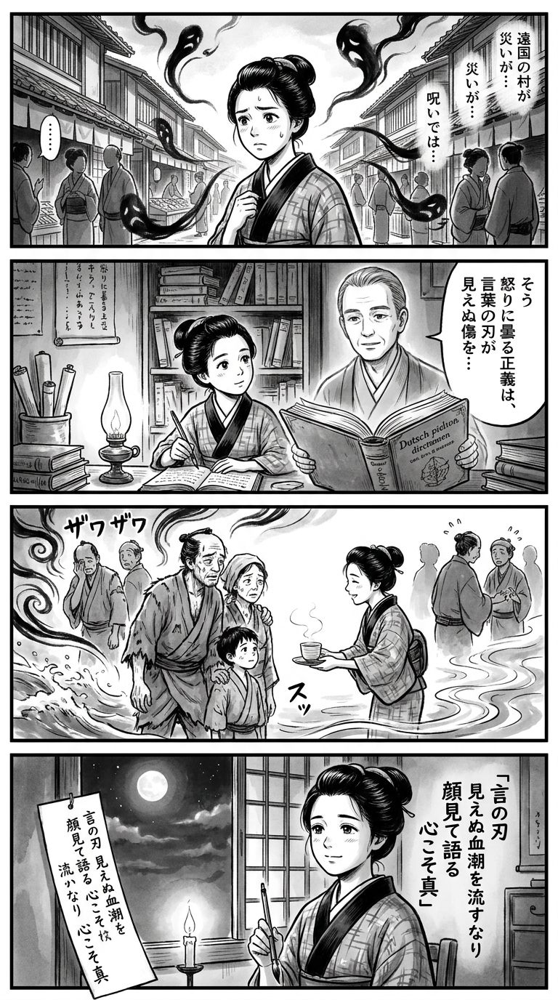

> **Language**: [日本語](../ja/血の雫_review.html) | [English](../en/血の雫_review.html) | [繁體中文](../zh-tw/血の雫_review.html)
>
> [← Top / トップページ](../../)

# 📖 書籍資訊
- **標題**: 血の雫  
- **作者**: 相場英雄  
- **ASIN**: B09HBTGD8V  
- **URL**: [https://www.amazon.co.jp/dp/B09HBTGD8V](https://www.amazon.co.jp/dp/B09HBTGD8V)  

---

<picture>
  <source srcset="../../images/reviews/血の雫_4panel.webp" type="image/webp">
  
</picture>
## 🎯 這本書的核心
《血の雫》是一部社會派警察小說，將網路社會的匿名性所帶來的暴力與震災後福島的偏見交織在一起。透過網路上的誹謗中傷轉化為現實中的殺意的過程，尖銳地描繪出現代社會的倫理崩壞。

故事的中心是對於來自災區者的歧視和風評受害的憤怒。作者揭露了奪走受害者尊嚴的「第二次災害」的中傷結構，並質疑正義與報復的界限。

刑警們的踏實調查與人性的共鳴，作為網路時代冷酷資訊社會中的希望象徵而被描繪。對於失去的「原風景」的懷念，以及恢復面對面的關係，成為本書靜默的祈禱。

---

## 💡 關鍵洞察
- **匿名性放大惡意**  
　網路上的匿名性使個人的倫理麻痺，成為群眾暴力的溫床。作者描繪了現實與虛擬的界限模糊時，人類是如何輕易變得殘酷。

- **風評受害是「第二次災害」**  
　震災的物理損害相比，偏見與中傷所造成的精神創傷更深刻地傷害人心。凸顯了社會也可能成為加害者的結構性問題。

- **正義與報復的界限模糊**  
　當受害者的憤怒轉化為暴力的瞬間，正義容易扭曲。作者展示了「憤怒的正當化」是多麼危險，映射出現代的倫理混亂。

- **人性的接觸引導真相**  
　刑警們的「腳踏實地」的調查象徵著重視人類信任而非數位資訊的態度。直接對話的累積是通往真相與和解的唯一途徑。

- **原風景是人心的依歸**  
　對於失去土地的記憶的描寫，表達了對於隨著文明進步而失去的人性之哀傷。復興不僅是物理上的重建，更是心靈風景的恢復。

---

## 🔍 與現代文脈的關聯
本書的主題與現代日本所面臨的「受害的不可視化」深深相連。社交媒體上的誹謗中傷、風評受害，以及對受害者的指責結構，持續在現實社會中成為問題。

如同#MeToo運動和霸凌問題的討論所示，社會對於封閉受害者聲音的壓力仍然根深蒂固。《血の雫》可以被視為對這種沉默結構的文學控訴。

此外，作品在描繪復仇或報復時並不將其視為「正義的延伸」，而是探討其代價與連鎖，對現代的倫理成熟提出質疑。即使科技進步，若心靈未能成熟，社會也將崩潰，這一警鐘貫穿整個故事。

---

## 🚀 實踐建議
1. **意識發言的責任**  
　匿名的言語也可能成為現實的暴力。在發帖前自問「這句話是否會傷害到某人」，是最基本的倫理。

2. **養成檢視偏見的習慣**  
　檢查對於災區或弱者的無意識偏見，並保持直接確認資訊的態度。風評源於無知，因此努力去了解將成為防波堤。

3. **重視直接對話**  
　不僅僅是透過螢幕的關係，面對面交流能減少誤解與敵意。重建人際關係是治癒社會分裂的第一步。

4. **不輕視踏實的努力**  
　在追求效率與即時性的風潮中，誠實的積累能產生信任與真相。刑警們的態度是對任何職業都適用的普遍教訓。

5. **記住失去的風景**  
　持續關注地方的記憶與自然，支撐人類的倫理。復興不僅是物理重建，也是心靈風景的再生行為。

---

## ⭐ 總評
《血の雫》是一部揭露社會黑暗的懸疑小說，同時也是一部深刻探討人類尊嚴的倫理小說。以冷靜的筆觸與靜謐的情感，描繪了網路的匿名性、風評受害以及報復的連鎖等現代主題。

讀者將被迫重新思考在憤怒與悲傷的盡頭，「與人面對面」的意義。這本書不僅向關心社會問題的讀者提出質疑，也向所有生活在現代的人發出挑戰。

---

&copy; shioki | [CC BY-NC-SA 4.0](https://creativecommons.org/licenses/by-nc-sa/4.0/)
