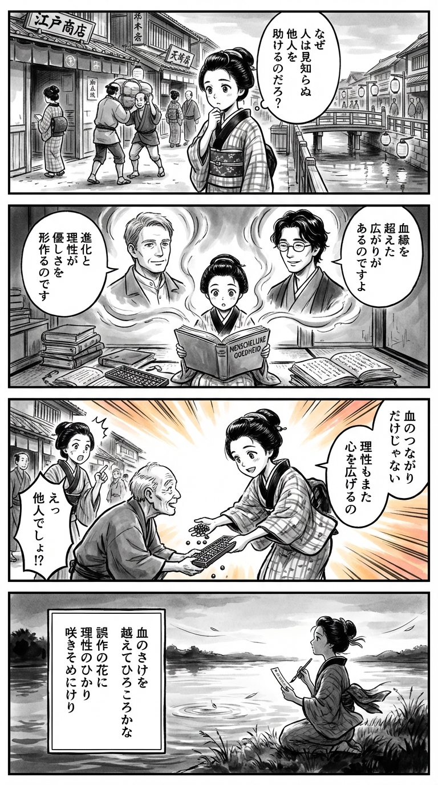

> **Language**: [日本語](../ja/親切の人類史――ヒトはいかにして利他の心を獲得したか_review.html) | [English](../en/親切の人類史――ヒトはいかにして利他の心を獲得したか_review.html) | [繁體中文](../zh-tw/親切の人類史――ヒトはいかにして利他の心を獲得したか_review.html)
>
> [← Top / トップページ](../../)

# 書籍評論（繁體中文）

## 📖 書籍資訊
- **標題**: 親切的歷史——人類如何獲得利他的心  
- **作者**: 麥可·E·麥卡洛 和 的場知之  
- **ASIN**: B0BPY77TH2  
- **URL**: [https://www.amazon.co.jp/dp/B0BPY77TH2](https://www.amazon.co.jp/dp/B0BPY77TH2)  

---

<picture>
  <source srcset="../../images/reviews/親切の人類史――ヒトはいかにして利他の心を獲得したか_4panel.webp" type="image/webp">
  
</picture>
## 🎯 本書的核心
本書試圖從進化心理學和生物學的角度揭示人類如何獲得「對陌生人施以親切」這一進化上異常的行為。作者麥卡洛將利他主義視為自然選擇的副產品，而非僅僅是道德美德，並論述其「誤作動」如何成為現代社會慈善和共感的基礎。

書中參考了達爾文的理論、漢密爾頓的包容適應度、群體選擇論等，描繪了人類的親切心如何從血緣選擇擴展到文化理性。此外，還展示了科技和貿易如何擴展「幫助的能力」，文明化又如何成為超越本能的契機。

本書的核心在於，親切並非天生的善良，而是理性和文化重新設計的進化成果，這一逆向的洞察令人深思。

---

## 💡 關鍵洞察
- **對陌生人的親切源於進化的「誤作動」**  
　進化上看似不合理的對他者的援助，被解釋為對血緣者合作本能的擴展。這一「誤作動」成為現代社會慈善和公共精神的起點。

- **共感是一個有限的系統**  
　共感本質上是針對身邊的人，而非普遍的人道主義。因此，若不通過教育或制度有意識地擴展，共感容易變得封閉。

- **理性和文化超越本能**  
　在文明化的過程中，理性和世界主義發展，使親切的範圍從家庭擴展到整個社會。人類是唯一一種能夠用理性克服進化限制的物種。

- **血緣選擇形成了利他的原型**  
　親子和兄弟間的合作在遺傳上是有利的，這促進了利他的進化。隨後，通過文化學習，對非血緣者的合作得以擴展。

- **人類的合作是靈活且可變的**  
　人類不像社會性昆蟲那樣有固定的分工，而是根據情況改變角色。這種靈活性支持了文化進化和社會創造力。

---

## 🔍 與現代背景的關聯
疫情以來，全球對「親切」和「共感」的重新評價愈發明顯。志願活動和線上捐款的增加，正是麥卡洛所指出的「理性和制度擴展利他主義」的現代實例。

此外，透過AI和數位技術的「數位利他」潮流，與本書的討論相呼應。科技擴展「幫助的能力」的觀點，暗示了在AI倫理和氣候變遷等全球性議題中的合作新形式。

再者，氣候危機和社會孤立等現代問題，迫使我們面對超越進化限制的共感挑戰。本書強烈主張，在這樣的時代，「理性重新設計親切」是不可或缺的。

---

## 🚀 實踐建議
1. **有意識地擴展共感**  
　自然的共感往往偏向身邊的人，因此需要通過教育、閱讀和異文化交流來訓練想像「遙遠的他者」。這樣可以擴大共感的範圍。

2. **設計「可見的」支持**  
　人類對具體個體的反應比對抽象痛苦更為敏感。在支持活動中，通過提供故事和人物形象，可以激發共感和行動。

3. **用理性和制度修正本能的偏差**  
　民主和透明的制度可以抑制對血緣和關係的偏見。持續社會親切需要倫理教育和制度設計的雙重支持。

4. **利用科技擴展幫助的能力**  
　線上捐款和志願者平台等技術是實現利他主義的工具。應該利用數位空間來支持更多的人。

5. **自覺自我中心的注意力**  
　理解人類的注意力是自我中心的事實，並在日常生活中訓練自己關注他人的處境。這是共感的第一步。

---

## ⭐ 總體評價
《親切的歷史》是一部超越善惡和道德框架，從進化的背景重新定義人類親切的雄心勃勃之作。將利他主義視為「誤作動」的逆向視角，為讀者帶來深刻的智識刺激。

本書跨越進化心理學、倫理學和社會制度論，促進了對現代社會「親切重新設計」的思考，對於關心AI時代倫理和全球議題的讀者而言，無疑是必讀之作。讀後將能獲得將人類的善良視為進化與理性的結晶的新視角。

---

&copy; shioki | [CC BY-NC-SA 4.0](https://creativecommons.org/licenses/by-nc-sa/4.0/)
