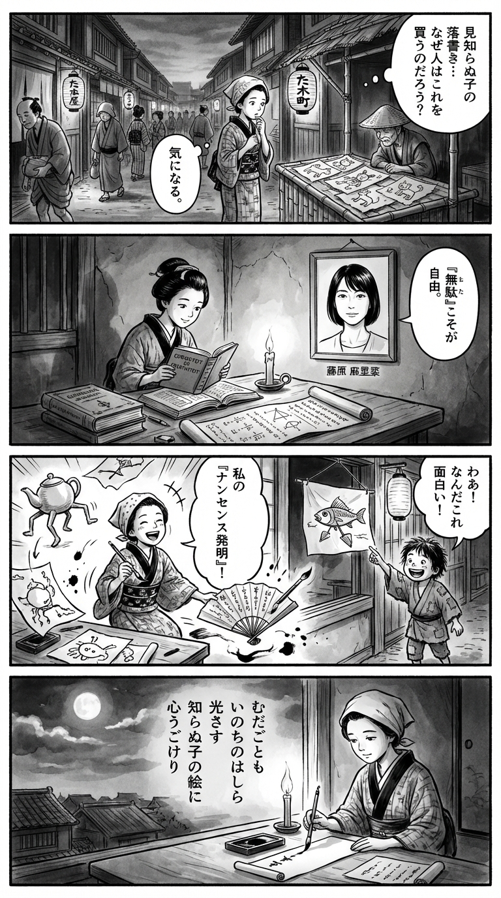

---
---
> **Language**: [日本語](../ja/麻里菜-メルカリで知らん子の絵を買う_review.html) | [English](../en/麻里菜-メルカリで知らん子の絵を買う_review.html) | [繁體中文](../zh-tw/麻里菜-メルカリで知らん子の絵を買う_review.html)
>
> [← Top / トップページ](../../)

## 📖 書籍資訊
- **書名**: メルカリで知らん子の絵を買う  
- **作者**: 藤原 麻里菜  
- **ASIN**: B0DZ23PCZ6  
- **URL**: [https://www.amazon.co.jp/dp/B0DZ23PCZ6](https://www.amazon.co.jp/dp/B0DZ23PCZ6)  

---

## 對白

### Panel 1
**Scene**: 傍晚的江戶小巷裡，身著和服的町娘走過一個小市集攤位，攤上擺著孩子們奇怪的塗鴉。她停下腳步，既困惑又被吸引，心想：「為什麼有人會買陌生孩子的塗鴉呢？」周圍是木造房屋、燈籠與穿著和服的行人，日常的喧囂中帶著一絲靜謐的好奇。  
**Dialogue**: （心想）「這些畫……究竟有什麼吸引人的地方呢？」

### Panel 2
**Scene**: 在燭光搖曳的小書房裡，町娘坐在書案前，一邊閱讀荷蘭書籍中關於「好奇與創造」的章節，一邊整理和算的卷軸。牆上掛著一幅女子肖像，短直髮、神情開朗而沉靜，似乎帶著幽默與思索。那畫像彷彿正看著她，輕聲低語：「無用即是自由。」  
**Dialogue**: （畫像的聲音）「無用之物，才讓心靈自由。」

### Panel 3
**Scene**: 町娘開始嘗試畫出荒誕的圖案——長著腳的茶壺、會寫詩的扇子。她為自己的「無用發明」笑出聲，並將其中一幅掛在家門外。一個路過的孩子停下腳步，好奇地微笑。畫面充滿動感與幽默，展現出擁抱「無用」的快樂。  
**Dialogue**: 町娘（笑著）「或許……這樣的無用，也是一種樂趣呢。」

### Panel 4
**Scene**: 夜深，町娘坐在窗邊，凝視月光映在筆與硯上的光影。她提筆，在細長的紙條上寫下一首短歌，體現書中思想的精髓。墨跡柔和流暢，氣氛寧靜而內省。  
**Dialogue**: （心中默念）「若無用之物也能動心，那便是生命的光吧……」  
**Tanka (translation)**:  
無用之事，亦是生命的支柱。  
一道光照入心底，  
為陌生孩子的畫，  
心靈微微顫動。  
**Tanka (original)**:  
むだごとも  
いのちのはしら  
光さす  
知らぬ子の絵に  
心うごけり

## 🎯 本書的核心
《メルカリで知らん子の絵を買う》是一部將「無用」「多餘」「不必要」等常被視為負面的概念，重新定義為創造與自由之源的隨筆集。作者藤原麻里菜透過觀察自己在憂鬱、孤獨與對社會的違和感中所做出的奇特且非理性的行動，從中發現了活下去的力量。  

她的實踐是一種對以效率與生產力為至上的現代社會的靜默反抗，透過「製造無用之物」的行為，嘗試奪回人類的創造性。購買「陌生孩子的畫」這件事本身，就創造了與他人的偶然連結，並讓人重新思考存在的意義。  

本書以幽默與實驗精神，描繪出「在無意義之中蘊藏人生豐富性」的悖論，是一本極具現代感的哲學之書。  

---

## 💡 關鍵洞見
- **「無用」是創造之母**  
  藤原主張，「有勇氣去做無用之事」才能孕育未來的價值。在過度追求效率的社會中，那些被忽略的「留白」，正是創造力的溫床，也是找回人性的重要關鍵。  

- **自由存在於非理性之中**  
  「買兒童服裝」「不撐傘」等行為，是脫離社會所謂「正確」後所獲得的自由象徵。當人遵循情感與衝動而非理性時，自我解放便由此展開。  

- **即使在憂鬱中，心動仍是生命的力量**  
  即使身陷絕望，只要去思考那些「無關緊要的事」，心就會再次開始運轉。藤原並非試圖戰勝憂鬱，而是在其中尋找「活著的好奇心」。  

- **學會愛無用之物，並勇於放手**  
  她以「大便」比喻創作物的幽默背後，其實是一種不執著的灑脫。擁抱那些不再需要的東西，然後學會放下，正是重生的過程。  

- **孤獨是創造的夥伴**  
  不畏懼無聊與孤獨，並將其視為遊戲，是自立的象徵。當人能將孤獨昇華為「打發時間」的樂趣時，便能再次與自己相遇。  

---

## 🔍 與現代脈絡的關聯
2024〜2025年間，「製造無用之物」與「慢生活」成為熱門話題，本書正位於這股潮流的中心。在被效率壓垮的社會中，肯定非生產性的行動，已成為恢復心理健康與創造力的重要議題。  

此外，隨著像是 Mercari 這類 C2C 平台的擴張，「與陌生人之間的匿名連結」也孕育出新型的人際關係。藤原「購買陌生孩子的畫」的行為，象徵著數位時代中孤獨與共存的樣貌。  

在出版與創作領域中，這種「非效率的創造」也被視為推動多樣性的原動力，而本書可說是這股思想潮流的精神支柱之一。  

---

## 🚀 實踐建議
1. **刻意去做無用的事**  
   不追求意義或目的，刻意進行非理性的行動。像是「單腳站著讀書」這樣的舉動，能打破思考框架，成為創造力的訓練。  

2. **重新審視不需要的東西，感謝後再放手**  
   在丟棄之前，先思考「為什麼它變得不需要」，藉此整理與過去的關係。放手本身，就是為下一次創造做準備。  

3. **對「無關緊要的事」感到興奮**  
   在鬱悶的日子裡，讓自己被那些看似無意義的事打動。微小的好奇心，能重新啟動停滯的情感。  

4. **練習從他人眼光中解放**  
   穿上不適合的衣服、嘗試誇張的妝容，不在意他人的評價。與社會的「正確」保持距離，能培養真正的自我肯定感。  

5. **將閒暇轉化為創造的時間**  
   不要害怕無聊，享受「在沙坑玩耍」「仰望天空」等非生產性的時光。當孤獨與遊戲結合，生活將變得更加豐富。  

---

## ⭐ 總體評價
《メルカリで知らん子の絵を買う》是一本能拯救那些被「效率至上主義」壓得喘不過氣的現代人的書。藤原麻里菜以幽默與哲學融合的筆觸，提醒我們「有勇氣去做無用之事」。  

這本書特別推薦給想重拾創造力的人、感到孤獨的人，以及那些快要失去「活著意義」的人。閱讀它，將讓你重新發現隱藏在無用之中的自由與希望。

---

&copy; shioki | [CC BY-NC-SA 4.0](https://creativecommons.org/licenses/by-nc-sa/4.0/)
